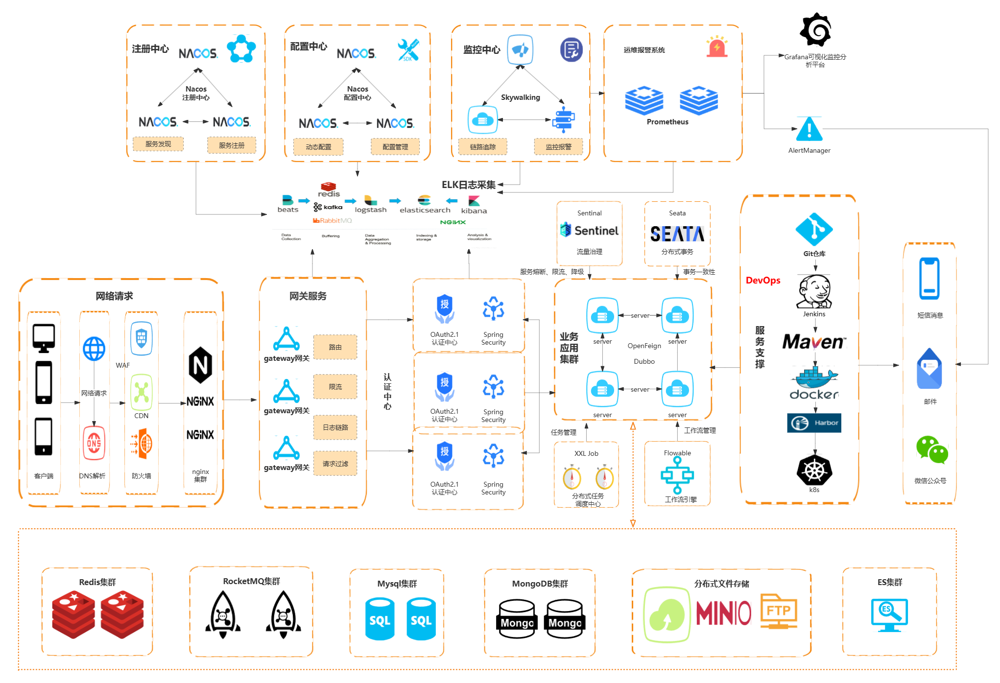

=== 🎉 项目备注

- 项目：KCloud-Platform-IoT（阻塞式）
- 作者：老寇
- 语言：Java
- 时间：2022.06.15 ~ 至今

=== 📣 项目介绍

image::doc/image/logo/logo.png[LOGO,500,align=center]

KCloud-Platform-IoT（阻塞式）（老寇IoT云平台）是一个企业级微服务架构的IoT云平台。基于Spring Boot 3.3.1、Spring Cloud 2023.0.3、Spring Cloud Alibaba 2023.0.1.2 最新版本开发的云服务多租户IoT平台。 遵循SpringBoot编程思想，使用阿里COLA应用框架构建，高度模块化和可配置化。具备服务注册&发现、配置中心、灰度路由、服务限流、熔断降级、监控报警、多数据源、高亮搜索、分布式任务调度、分布式链路、分布式缓存、分布式事务、分布式存储、分布式锁等功能，用于快速构建微服务项目。目前支持Shell、Docker等多种部署方式，并且支持GraalVM和虚拟线程。实现RBAC权限、其中包含系统管理、系统监控、数据分析等几大模块。 遵循阿里代码规范，采用RESTFul设计风格及DDD(领域驱动设计)思想，代码简洁、架构清晰，非常适合作为基础框架使用。

image:https://github.com/KouShenhai/KCloud-Platform-IoT/actions/workflows/maven.yml/badge.svg?branch=master[Maven Ci Build Stauts,link=https://github.com/KouShenhai/KCloud-Platform-IoT/actions/workflows/maven.yml]
image:https://app.deepsource.com/gh/KouShenhai/KCloud-Platform-IoT.svg/?label=active+issues&show_trend=true&token=dsp_7fcdb2050e509b27f5d2ab8f5f1109bcd468[DeepSource Active Issues,link=https://app.deepsource.com/gh/KouShenhai/KCloud-Platform-IoT]
image:https://app.deepsource.com/gh/KouShenhai/KCloud-Platform-IoT.svg/?label=resolved+issues&show_trend=true&token=dsp_7fcdb2050e509b27f5d2ab8f5f1109bcd468[DeepSource Resolved Issues,link=https://app.deepsource.com/gh/KouShenhai/KCloud-Platform-IoT]

image:https://app.codacy.com/project/badge/Grade/1dbb1e146e784a3f8a96a6cb4e185951[Codacy,link=https://app.codacy.com/gh/KouShenhai/KCloud-Platform-IoT/dashboard]
image:https://www.codefactor.io/repository/github/KouShenhai/KCloud-Platform-IoT/badge[CodeFactor,link=https://www.codefactor.io/repository/github/KouShenhai/KCloud-Platform-IoT]

image:https://img.shields.io/github/stars/KouShenhai/KCloud-Platform-IoT?logo=github[GitHub stars,link=https://github.com/KouShenhai/KCloud-Platform-IoT/stargazers]
image:https://img.shields.io/github/forks/KouShenhai/KCloud-Platform-IoT?logo=github[GitHub forks,link=https://github.com/KouShenhai/KCloud-Platform-IoT/forks]
image:https://img.shields.io/github/watchers/KouShenhai/KCloud-Platform-IoT?logo=github[GitHub watchers,link=https://github.com/KouShenhai/KCloud-Platform-IoT]
image:https://img.shields.io/github/last-commit/KouShenhai/KCloud-Platform-IoT[GitHub last commit,link=https://github.com/KouShenhai/KCloud-Platform-IoT]

image:https://gitee.com/laokouyun/KCloud-Platform-IoT/badge/star.svg?theme=dark[Gitee star,link=https://gitee.com/laokouyun/KCloud-Platform-IoT/stargazers]
image:https://gitee.com/laokouyun/KCloud-Platform-IoT/badge/fork.svg?theme=dark[Gitee fork,link=https://gitee.com/laokouyun/KCloud-Platform-IoT/members]

image:https://img.shields.io/static/v1?label=Spring%20Framework&message=6.1.11&color=green[Spring Framework,link=https://spring.io/projects/spring-framework]
image:https://img.shields.io/static/v1?label=Spring%20Boot&message=3.3.1&color=green[Spring Boot,link=https://spring.io/projects/spring-boot]
image:https://img.shields.io/static/v1?label=Spring%20Cloud&message=2023.0.3&color=green[Spring Cloud,link=https://spring.io/projects/spring-cloud]
image:https://img.shields.io/static/v1?label=Spring%20Cloud%20Alibaba&message=2023.0.1.2&color=orange[Spring Cloud Alibaba,link=https://github.com/alibaba/spring-cloud-alibaba]
image:https://img.shields.io/static/v1?label=OAuth%202.1&message=1.3.1&color=blue[OAuth 2.1,link=https://spring.io/projects/spring-authorization-server]

image:https://img.shields.io/badge/GraalVM-21.0.1-blue.svg[GraalVM,link=https://www.graalvm.org/downloads]
image:https://img.shields.io/badge/Maven-3.9.4-blue[Maven,link=https://maven.apache.org/]

image:https://img.shields.io/badge/Q群-465450496-blue.svg[KCloud-Platform开源交流群,link=https://jq.qq.com/?_wv=1027&k=Ec8T76dR]

=== 😋 项目背景

- 学习微服务架构设计并实践于生产
- 整合所学技术方便快速搭建项目
- 持续优化代码来提高代码质量
- 复制粘贴代码提高生产效率
- 学习DDD思想并落地实践

=== 🔗 在线体验（正在重构，敬请期待）

https://www.laokou.org.cn[老寇IoT云平台在线体验（请点击我，境外服务器网络延迟请稍候）]

=== 🔖 在线文档

https://koushenhai.github.io[老寇IoT云平台在线文档（请点击我）]

=== 😎 开发计划

https://docs.qq.com/sheet/DUGhCdGVZWmVxT0VJ?tab=BB08J2[开发计划（需要登录）]

=== 🎁 项目推荐

https://github.com/KouShenhai/KCloud-Platform-Reactive-IoT[作者的另一个开源IoT项目（响应式）]

=== 💪 版本号

特此说明，与Spring Boot版本保持一致

=== 🔎 功能介绍

🚀 正在重构，敬请期待

=== 💡 系统架构

=== ✂ 技术体系

==== 🎯 Spring全家桶及核心技术版本

[width=100%]
|===
|组件                         |版本

|Spring Boot                 |3.3.1
|Spring Cloud                |2023.0.3
|Spring Cloud Alibaba        |2023.0.1.2
|Spring Boot Admin           |3.3.2
|Spring Authorization Server |1.3.1
|Mybatis Plus                |3.5.7
|Nacos                       |2.3.3
|Seata                       |2.0.0
|Sentinel                    |1.8.8
|Redis                       |7.2.5
|Elasticsearch               |8.14.2
|RocketMQ                    |5.2.0
|Netty                       |4.1.111.Final
|Kafka                       |3.7.1
|EMQX                        |5.7.1
|Postgresql                  |16.3
|TDengine                    |3.3.2.0
|Liquibase                   |4.28.0
|Snail Job                   |1.0.0
|===

==== 🍺 相关技术

- 配置中心&服务注册&发现：Nacos
- API网关：Spring Cloud Gateway
- 认证授权：Spring Security OAuth2 Authorization Server
- 远程调用：Spring Cloud OpenFeign & OkHttp & HttpClient & WebClient & RestClient
- 负载均衡：Spring Cloud Loadbalancer
- 服务熔断&降级&限流：Sentinel
- 分库分表：Mybatis Plus
- 分布式事务：Seata & RocketMQ
- 消息队列：RocketMQ & Kafka & MQTT
- 服务监控：Spring Boot Admin & Prometheus
- 高亮搜索：Elasticsearch
- 链路跟踪：SkyWalking
- 任务调度：Snail Job
- 日志分析：EFK
- 缓存&分布式锁：Redis & Redisson
- 统计报表：MongoDB
- 对象存储：Amazon S3
- 自动化部署：Docker
- 网络通讯：Netty
- 持续集成&交付：Jenkins
- 持久层框架：Mybatis Plus
- JSON序列化：Jackson
- 对象转换：MapStruct
- 数据库：Postgresql
- 时序数据库：TDengine
- 数据库迁移：Liquibase

==== 🌴 项目结构

[source]
----
├── laokou-common
        └── laokou-common-log                      --- 日志组件
        └── laokou-common-core                     --- 核心组件
        └── laokou-common-cors                     --- 跨域组件
        └── laokou-common-mqtt                     --- 消息组件
        └── laokou-common-redis                    --- 缓存组件
        └── laokou-common-kafka                    --- 消息组件
        └── laokou-common-log4j2                   --- 日志组件
        └── laokou-common-mongodb                  --- 报表组件
        └── laokou-common-rocketmq                 --- 消息组件
        └── laokou-common-algorithm                --- 算法组件
        └── laokou-common-prometheus               --- 监控组件
        └── laokou-common-openapi-doc              --- 文档组件
        └── laokou-common-rate-limiter             --- 限流组件
        └── laokou-common-elasticsearch            --- 搜索组件
        └── laokou-common-bom                      --- 依赖版本库
        └── laokou-common-i18n                     --- 国际化组件
        └── laokou-common-sensitive                --- 敏感词组件
        └── laokou-common-extension                --- 扩展点组件
        └── laokou-common-lock                     --- 分布式锁组件
        └── laokou-common-trace                    --- 链路跟踪组件
        └── laokou-common-nacos                    --- 注册发现组件
        └── laokou-common-netty                    --- 网络通讯组件
        └── laokou-common-domain                   --- 领域事件组件
        └── laokou-common-crypto                   --- 加密解密组件
        └── laokou-common-secret                   --- 接口验签组件
        └── laokou-common-security                 --- 认证授权组件
        └── laokou-common-openfeign                --- 远程调用组件
        └── laokou-common-data-cache               --- 数据缓存组件
        └── laokou-common-mybatis-plus             --- 对象映射组件
        └── laokou-common-seata                    --- 分布式事务组件
        └── laokou-common-tdengine                 --- 时序数据库组件
        └── laokou-common-sentinel                 --- 服务限流&熔断降级组件
├── laokou-cloud
        └── laokou-gateway                         --- API网关
        └── laokou-monitor                         --- 服务监控
        └── laokou-register                        --- 服务治理
        └── laokou-sentinel                        --- 流量治理
        └── laokou-seata                           --- 分布式事务
├── laokou-service
        └── laokou-iot                             --- 物联网模块
        └── laokou-auth                            --- 认证授权模块
        └── laokou-admin                           --- 后台管理模块
        └── laokou-report                          --- 报表统计模块
        └── laokou-generator                       --- 模板生成模块
        └── laokou-modlule
                └── laokou-api                     --- API模块
                └── laokou-im                      --- 即时通讯模块
                └── laokou-logstash                --- 日志收集模块
----

=== 🔒 安全报告

image::https://www.murphysec.com/platform3/v31/badge/1810494453766979584.svg[https://www.murphysec.com/console/report/1717540049993383936/1810494453766979584]

=== 👊 性能评测

link:性能测试.adoc[请点击我，查看详情]

=== 😛 用户权益（点个Star，拜托啦~🙏）

- 采用Apache2.0开源协议，请保留作者、Copyright信息
- 采用Apache2.0开源协议，请保留作者、Copyright信息
- 采用Apache2.0开源协议，请保留作者、Copyright信息

=== 😻 开源协议

KCloud-Platform-IoT 开源软件遵循 https://www.apache.org/licenses/LICENSE-2.0.html[Apache 2.0 协议] 请务必保留作者、Copyright信息

=== 🔧 参与贡献

link:CONTRIBUTING.adoc[请点击我，查看规范]

=== 👀 项目地址

https://github.com/KouShenhai/KCloud-Platform-IoT[Github 地址]

https://gitee.com/laokouyun/KCloud-Platform-IoT[Gitee 地址]

=== 🍚 赞助打赏（用于服务器日常维护）

image:doc/image/wxzp.jpg[微信支付,201,300]
image:doc/image/zfb.jpg[支付宝支付,201,300]
image:doc/image/gzh.jpg[微信公众号,201,300]
image:doc/image/zsxq.jpg[知识星球,201,300]

=== 🙋 技术交流

image:doc/image/wx.png[微信,250,300]
image:doc/image/wxq.png[微信交流群,250,300]
image:doc/image/qqq.png[QQ交流群,250,300]

=== 🐭 鸣谢组织

https://spring.io[Spring社区]

https://www.jetbrains.com/community[Jetbrains社区]

https://github.com/alibaba[阿里巴巴社区]

https://www.renren.io[人人社区]

https://www.ruoyi.vip[若依社区]

https://baomidou.com[苞米豆社区]

https://gitter.im/livk-cloud/community[livk-cloud社区]

https://github.com/laokouyun[laokouyun社区]

非常感谢 Jetbrains 提供的开源 License

image::doc/image/jb_beam.png[jb_beam,100,100,link=https://www.jetbrains.com/community/opensource/?utm_campaign=opensource&utm_content=approved&utm_medium=email&utm_source=newsletter&utm_term=jblogo#support]

=== 🐼 鸣谢个人

[width=100%]
|===
|序号 |头像 |名字

|1   |image:https://avatars.githubusercontent.com/u/48756217?s=64&v=4[KouShenhai的头像,50,50]       |https://github.com/KouShenhai[KouShenhai]
|2   |image:https://avatars.githubusercontent.com/u/26246537?s=64&v=4[liang99的头像,50,50]          |https://github.com/liang99[liang99]
|3   |image:https://avatars.githubusercontent.com/u/50291874?s=64&v=4[livk-cloud的头像,50,50]       |https://github.com/livk-cloud[livk-cloud]
|4   |image:https://avatars.githubusercontent.com/u/21030225?s=64&v=4[liukefu2050的头像,50,50]      |https://github.com/liukefu2050[liukefu2050]
|5   |image:https://avatars.githubusercontent.com/u/127269482?s=64&v=4[HalfPomelo的头像,50,50]      |https://github.com/HalfPomelo[HalfPomelo]
|6   |image:https://avatars.githubusercontent.com/u/69209385?s=64&v=4[lixin的头像,50,50]            |https://github.com/lixin[lixin]
|7   |image:https://avatars.githubusercontent.com/u/2041471?s=64&v=4[simman的头像,50,50]            |https://github.com/simman[simman]
|8   |image:https://avatars.githubusercontent.com/u/43296325?s=64&v=4[suhengli的头像,50,50]         |https://github.com/suhengli[suhengli]
|9   |image:https://avatars.githubusercontent.com/u/89563182?s=64&v=4[gitkakafu的头像,50,50]        |https://github.com/gitkakafu[gitkakafu]
|10  |image:https://avatars.githubusercontent.com/u/32741993?s=64&v=4[LeiZhiMin1的头像,50,50]       |https://github.com/LeiZhiMin1[LeiZhiMin1]
|===

=== ⛳️ 赞助列表（感谢各位大佬的赞助）

[width=100%]
|===
|时间         |网名        |赞助           |备注

|2024/04/19  |*保熟       |￥188.00      |越做越好
|2024/03/20  |A细节*      |￥66.00       |无
|2024/03/03  |y*i        |￥58.88       |无
|2024/01/30  |*阳        |￥10          |无
|2023/12/22  |*民        |服务器         |无
|2023/12/08  |*来        |￥10          |希望越来越好，一直坚持下去
|2023/12/08  |*迪        |￥20          |越来越好，继续干下去
|2023/10/07  |何*        |￥399         |作者说：感谢支持
|2023/08/27  |*界        |￥10          |希望越来越好
|2023/06/29  |顺         |￥20          |希望项目一直做下去就好
|2023/03/27  |s*e        |￥10          |无
|===

=== 🚫 免责声明

禁止使用本项目从事一切违法犯罪活动。作者不承担任何法律责任，特此声明

=== 🐸 联系作者

https://kcloud.blog.csdn.net[博客：https://kcloud.blog.csdn.net]

https://mail.qq.com[邮箱：2413176044@qq.com]

http://wpa.qq.com/msgrd?v=3&uin=2413176044&Site=gitee&Menu=yes[QQ：243176044]

image::https://img.shields.io/badge/Q群-465450496-blue.svg[QQ群,link=https://jq.qq.com/?_wv=1027&k=Ec8T76dR]

image::https://starchart.cc/KouShenhai/KCloud-Platform-IoT.svg[GitHub Star 趋势]
