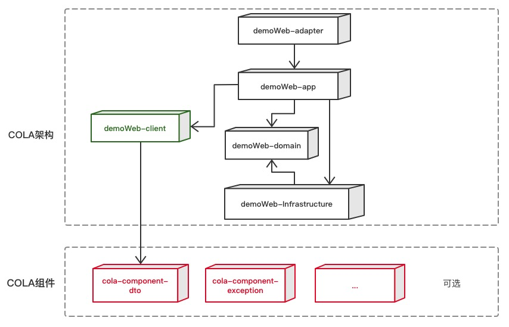
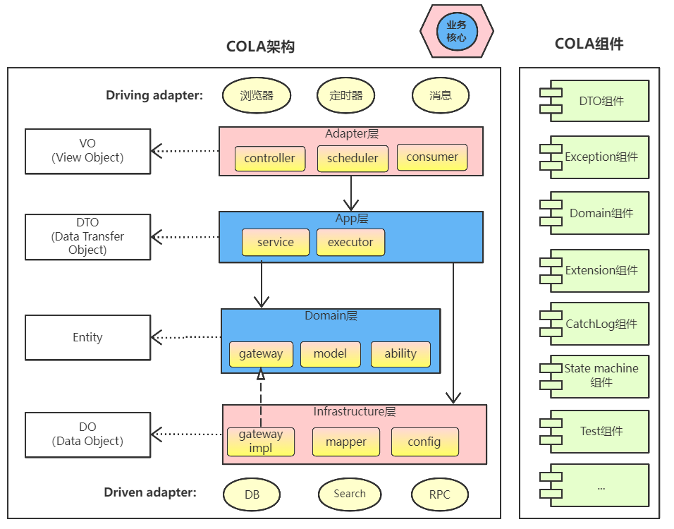
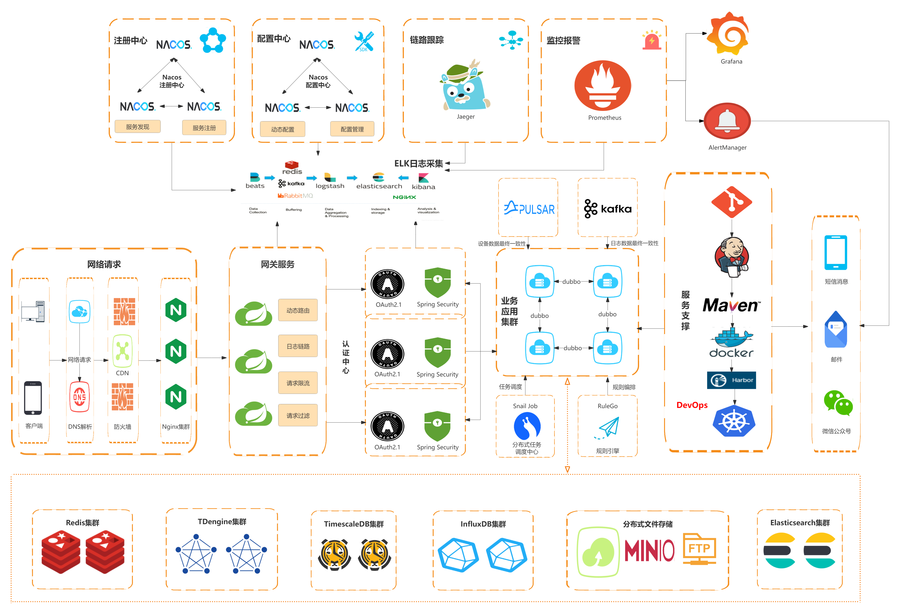
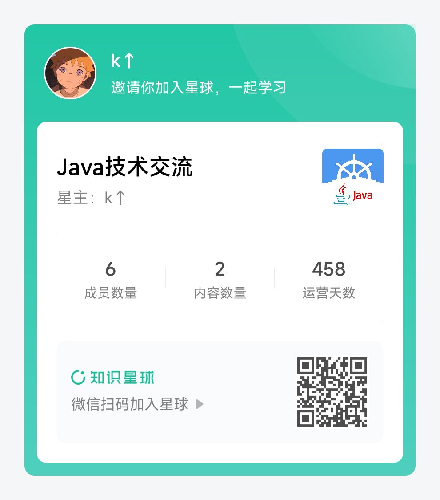
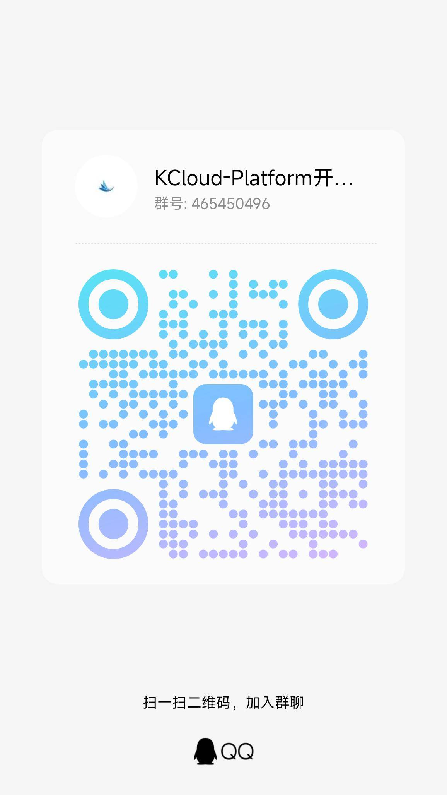

### 📌 作者的话

即使KCloud-Platform-IoT有诸多瑕疵，也掩盖不住它的光芒。

它就像是作者的孩子一样，在作者的眼中，它就是趋于完美的存在！

### 🎉 项目备注

- 项目：KCloud-Platform-IoT（阻塞式）
- 作者：老寇
- 语言：Java
- 时间：2022.06.15 ~ 至今

### 📣 项目介绍

<div style="text-align: center"></div>

KCloud-Platform-IoT（阻塞式）（老寇IoT云平台）是一个企业级微服务架构的IoT云平台。基于Spring Boot 3.4.1、Spring Cloud 2024.0.0、Spring Cloud Alibaba 2023.0.3.2 最新版本开发的云服务多租户IoT平台。 遵循SpringBoot编程思想，使用阿里COLA应用框架构建，高度模块化和可配置化。具备服务注册&发现、配置中心、灰度路由、服务限流、熔断降级、监控报警、多数据源、高亮搜索、分布式任务调度、分布式链路、分布式缓存、分布式事务、分布式存储、分布式锁等功能，用于快速构建IoT微服务项目。目前支持Shell、Docker、Kubernetes等多种部署方式，并且支持GraalVM和虚拟线程。实现RBAC权限、其中包含系统管理、物联管理、系统监控、数据分析等几大模块。 遵循阿里代码规范，采用RESTFul设计风格及DDD(领域驱动设计)思想，代码简洁、架构清晰，非常适合作为基础框架使用。

<a href="https://github.com/KouShenhai/KCloud-Platform-IoT/actions/workflows/maven.yml" target="_blank"></a>
<a href="https://github.com/KouShenhai/KCloud-Platform-IoT/actions/workflows/gradle.yml" target="_blank"></a>
<a href="https://github.com/KouShenhai/KCloud-Platform-IoT/actions/workflows/node.js.yml" target="_blank"></a>
<a href="https://dl.circleci.com/status-badge/redirect/circleci/Bvmh1W3CkTV7xQCz5au73K/KgCR3Kb3gXzuxQP6YLKBUX/tree/master" target="_blank"></a>

<a href="https://app.deepsource.com/gh/KouShenhai/KCloud-Platform-IoT" target="_blank"></a>
<a href="https://app.deepsource.com/gh/KouShenhai/KCloud-Platform-IoT" target="_blank"></a>
<a href="https://app.codacy.com/gh/KouShenhai/KCloud-Platform-IoT/dashboard" target="_blank"></a>
<a href="https://www.codefactor.io/repository/github/KouShenhai/KCloud-Platform-IoT" target="_blank"></a>

<a href="https://github.com/KouShenhai/KCloud-Platform-IoT/stargazers" target="_blank"></a>
<a href="https://github.com/KouShenhai/KCloud-Platform-IoT/forks" target="_blank"></a>
<a href="https://github.com/KouShenhai/KCloud-Platform-IoT" target="_blank"></a>
<a href="https://github.com/KouShenhai/KCloud-Platform-IoT" target="_blank"></a>

<a href="https://gitee.com/laokouyun/KCloud-Platform-IoT/stargazers" target="_blank"></a>
<a href="https://gitee.com/laokouyun/KCloud-Platform-IoT/members" target="_blank"></a>

<a href="https://gitcode.com/qq_39893313/KCloud-Platform-IoT" target="_blank"></a>

<a href="https://spring.io/projects/spring-framework" target="_blank"></a>
<a href="https://spring.io/projects/spring-boot" target="_blank"></a>
<a href="https://spring.io/projects/spring-cloud" target="_blank"></a>
<a href="https://github.com/alibaba/spring-cloud-alibaba" target="_blank"></a>
<a href="https://spring.io/projects/spring-authorization-server" target="_blank"></a>

<a href="https://www.graalvm.org/downloads" target="_blank"></a>
<a href="https://maven.apache.org/" target="_blank"></a>

<a href="https://codecov.io/gh/KouShenhai/KCloud-Platform-IoT" target="_blank"></a>
<a href="https://cla-assistant.io/KouShenhai/KCloud-Platform-IoT" target="_blank"></a>
<a href="https://github.com/KouShenhai/KCloud-Platform-IoT" target="_blank"></a>
<a href="https://wakatime.com/projects/KCloud-Platform-IoT" target="_blank"></a>
<a href="https://jq.qq.com/?_wv=1027&k=Ec8T76dR" target="_blank"></a>

### 😋 项目背景

- 学习微服务架构设计并实践于生产
- 整合所学技术方便快速搭建项目
- 持续优化代码来提高代码质量
- 复制粘贴代码提高生产效率
- 学习DDD思想并落地实践
- 项目驱动学习任何知识

### 👉 项目定位
只适用于中大型微服务项目【业务复杂】




### 🔗 在线体验

| 序号 |  账号   |    密码    |
|:--:|:-----:|:--------:|
| 1  | admin | admin123 |

[老寇IoT云平台在线体验（请点击我，境外服务器网络延迟请稍候）](https://www.laokou.org.cn)

### 🔖 在线文档

[老寇IoT云平台在线文档（请点击我）](https://koushenhai.github.io)

### 😎 开发计划

[开发计划（需要登录）](https://docs.qq.com/sheet/DUGhCdGVZWmVxT0VJ?tab=BB08J2)

### 🎁 项目推荐

[作者的另一个开源IoT项目（响应式）](https://github.com/KouShenhai/KCloud-Platform-Reactive-IoT)

### 💪 版本号

特此说明，与Spring Boot版本保持一致

### 🔎 功能介绍

🚀 正在重构，敬请期待

### 💡 系统架构

<div style="text-align: center"></div>

### ✂ 技术体系

#### 🎯 Spring全家桶及核心技术版本

|             组件              |      版本       |
|:---------------------------:|:-------------:|
|         Spring Boot         |     3.4.1     |
|        Spring Cloud         |   2024.0.0    |
|    Spring Cloud Alibaba     |  2023.0.3.2   |
|      Spring Boot Admin      |     3.4.1     |
| Spring Authorization Server |     1.4.1     |
|        Mybatis Plus         |   3.5.10.1    |
|            Nacos            |     2.4.3     |
|          Sentinel           |     1.8.8     |
|            Redis            |     7.4.2     |
|        Elasticsearch        |    8.17.0     |
|          RocketMQ           |     5.3.1     |
|            Netty            | 4.1.116.Final |
|            Kafka            |     3.9.0     |
|            EMQX             |     5.8.4     |
|         TimescaleDB         |      17       |
|          TDengine           |    3.3.5.0    |
|          Liquibase          |    4.30.0     |
|          Snail Job          |     1.1.2     |

#### 🍺 相关技术

- 配置中心&服务注册&发现：Nacos
- API网关：Spring Cloud Gateway
- 认证授权：Spring Security OAuth2 Authorization Server
- 远程调用：Spring Cloud OpenFeign & OkHttp & HttpClient & WebClient & RestClient
- 负载均衡：Spring Cloud Loadbalancer
- 服务熔断&降级&限流：Sentinel
- 分库分表：Mybatis Plus
- 分布式事务：RocketMQ
- 消息队列：RocketMQ & Kafka & MQTT
- 服务监控：Spring Boot Admin & Prometheus
- 高亮搜索：Elasticsearch
- 链路跟踪：Jaeger
- 任务调度：Snail Job
- 日志分析：EFK
- 缓存&分布式锁：Redis & Redisson
- 统计报表：MongoDB
- 对象存储：Amazon S3
- 自动化部署：Docker & Kubernetes
- 网络通讯：Netty
- 持续集成&交付：Jenkins
- 持久层框架：Mybatis Plus
- JSON序列化：Jackson
- 数据库：Postgresql
- 时序数据库：TimescaleDB & TDengine
- 数据库迁移：Liquibase
- 链路&指标采集：Micrometer

#### 🌴 项目结构

```markdown
├── laokou-common
        └── laokou-common-xss                      --- XSS组件
        └── laokou-common-log                      --- 日志组件
        └── laokou-common-core                     --- 核心组件
        └── laokou-common-cors                     --- 跨域组件
        └── laokou-common-mqtt                     --- 消息组件
        └── laokou-common-redis                    --- 缓存组件
        └── laokou-common-kafka                    --- 消息组件
        └── laokou-common-log4j2                   --- 日志组件
        └── laokou-common-tenant                   --- 租户组件
        └── laokou-common-mongodb                  --- 报表组件
        └── laokou-common-rocketmq                 --- 消息组件
        └── laokou-common-algorithm                --- 算法组件
        └── laokou-common-prometheus               --- 监控组件
        └── laokou-common-openapi-doc              --- 文档组件
        └── laokou-common-rate-limiter             --- 限流组件
        └── laokou-common-elasticsearch            --- 搜索组件
        └── laokou-common-bom                      --- 依赖版本库
        └── laokou-common-i18n                     --- 国际化组件
        └── laokou-common-sensitive                --- 敏感词组件
        └── laokou-common-extension                --- 扩展点组件
        └── laokou-common-lock                     --- 分布式锁组件
        └── laokou-common-trace                    --- 链路跟踪组件
        └── laokou-common-nacos                    --- 注册发现组件
        └── laokou-common-netty                    --- 网络通讯组件
        └── laokou-common-domain                   --- 领域事件组件
        └── laokou-common-crypto                   --- 加密解密组件
        └── laokou-common-secret                   --- 接口验签组件
        └── laokou-common-security                 --- 认证授权组件
        └── laokou-common-openfeign                --- 远程调用组件
        └── laokou-common-snail-job                --- 任务调度组件
        └── laokou-common-data-cache               --- 数据缓存组件
        └── laokou-common-mybatis-plus             --- 对象映射组件
        └── laokou-common-tdengine                 --- 时序数据库组件
        └── laokou-common-sentinel                 --- 服务限流&熔断降级组件
├── laokou-cloud
        └── laokou-nacos                           --- 服务治理
        └── laokou-gateway                         --- API网关
        └── laokou-monitor                         --- 服务监控
        └── laokou-sentinel                        --- 流量治理
        └── laokou-snail-job                       --- 分布式任务调度
├── laokou-service
        └── laokou-iot                             --- 物联网模块
        └── laokou-auth                            --- 认证授权模块
        └── laokou-admin                           --- 后台管理模块
        └── laokou-report                          --- 报表统计模块
        └── laokou-logstash                        --- 日志收集模块
        └── laokou-generator                       --- 模板生成模块
```

### 🔒 安全报告

<a href="https://www.murphysec.com/console/report/1717540049993383936/1810494453766979584" target="_blank"></a>

### 👊 性能评测

[请点击我，查看详情](性能测试.adoc)

### 😝 贡献者许可协议

[贡献者许可协议](https://cla-assistant.io/KouShenhai/KCloud-Platform-IoT)

### 😛 用户权益（点个Star，拜托啦~🙏）

- Apache2.0开源协议，请保留作者、Copyright信息，否则视为侵权【免费用于毕设、二开、商用、二次开源】
- Apache2.0开源协议，请保留作者、Copyright信息，否则视为侵权【免费用于毕设、二开、商用、二次开源】
- Apache2.0开源协议，请保留作者、Copyright信息，否则视为侵权【免费用于毕设、二开、商用、二次开源】

### 😻 开源协议

KCloud-Platform-IoT 开源软件遵循 [Apache 2.0 协议](https://www.apache.org/licenses/LICENSE-2.0.html) 请务必保留作者、Copyright信息

### 🐮 二次开源登记（二次开源不允许更换开源协议，否则视为侵权）

| 序号 |                              Github项目                               |                              Gitee项目                               |
|:--:|:-------------------------------------------------------------------:|:------------------------------------------------------------------:|
| 1  | [xht-cloud-platform](https://github.com/xhtcode/xht-cloud-platform) | [xht-cloud-platform](https://gitee.com/xhtrepo/xht-cloud-platform) |


### 🔧 参与贡献

[请点击我，查看规范](CONTRIBUTING.adoc)

### 👀 项目地址

[Github 地址](https://github.com/KouShenhai/KCloud-Platform-IoT)

[Gitee 地址](https://gitee.com/laokouyun/KCloud-Platform-IoT)

### 🔪 技术分享




### 🙋 技术交流




### 💧 技术培训\广告赞助\项目合作【加微信私聊】

| 序号 |    名称    |   金额    |                备注                 |
|:--:|:--------:|:-------:|:---------------------------------:|
| 1  | 技术指导【永久】 | ￥399.00 | 一对一项目指导技术指导远程指导,VIP微信交流群,全心全意为您服务 |
| 2  | 项目指导【永久】 | ￥199.00 |   一对一项目指导远程指导,VIP微信交流群,全心全意为您服务   |


| 序号 |     名称      |   金额    |         备注          |
|:--:|:-----------:|:-------:|:-------------------:|
| 1  | 广告赞助1【永久置顶】 | ￥199.00 | ReadMe和网站二选一【加微信私聊】 |
| 1  | 广告赞助2【永久置顶】 | ￥299.00 |  ReadMe+网站【加微信私聊】   |


| 序号 |  名称   | 备注 |
|:--:|:-----:|:--:|
| 1  | IoT项目 | ✅  |
| 2  | MES项目 | ✅  |
| 3  | CMS项目 | ✅  |
| 4  | ERP项目 | ✅  |
| 5  | OA项目  | ✅  |
| 6  | 电商项目  | ✅  |

### 🐭 鸣谢组织

[Spring社区](https://spring.io)

[Jetbrains社区](https://www.jetbrains.com/community)

[阿里巴巴社区](https://github.com/alibaba)

[人人社区](https://www.renren.io)

[若依社区](https://www.ruoyi.vip)

[苞米豆社区](https://baomidou.com)

[livk-cloud社区](https://gitter.im/livk-cloud/community)

[laokouyun社区](https://github.com/laokouyun)

非常感谢 Jetbrains 提供的开源 License

<a target="_blank" href="https://www.jetbrains.com/community/opensource/?utm_campaign=opensource&utm_content=approved&utm_medium=email&utm_source=newsletter&utm_term=jblogo#support"></a>

### 🐼 鸣谢个人


| 序号 |                                                       头像                                                        |                      名字                       |
|:--:|:---------------------------------------------------------------------------------------------------------------:|:---------------------------------------------:|
| 1  |                                      |  [KouShenhai](https://github.com/KouShenhai)  |
| 2  |      |     [liang99](https://github.com/liang99)     |
| 3  |                                      |  [livk-cloud](https://github.com/livk-cloud)  |
| 4  |                                     | [liukefu2050](https://github.com/liukefu2050) |
| 5  |  |  [HalfPomelo](https://github.com/HalfPomelo)  |
| 6  |                                           |       [lixin](https://github.com/lixin)       |
| 7  |                                           |      [simman](https://github.com/simman)      |
| 8  |                                        |    [suhengli](https://github.com/suhengli)    |
| 9  |                                       |   [gitkakafu](https://github.com/gitkakafu)   |
| 10 |                                      |  [LeiZhiMin1](https://github.com/LeiZhiMin1)  |

### ⛳️ 赞助列表（感谢各位大佬的赞助）

|     时间     |  网名   |   赞助    |         备注         |
|:----------:|:-----:|:-------:|:------------------:|
| 2024/12/08 |  t*   | ￥199.00 |         无          |
| 2024/12/02 |  'c*  | ￥399.00 |         无          |
| 2024/11/25 | tio*  | ￥520.00 | 希望KCloud飞起，实现专精特新! |
| 2024/08/01 | *ckai | ￥88.00  |        加油~         |
| 2024/04/19 |  *保熟  | ￥188.00 |        越做越好        |
| 2024/03/20 | A细节*  | ￥66.00  |         无          |
| 2024/03/03 |  y*i  | ￥58.88  |         无          |
| 2024/01/30 |  *阳   |   ￥10   |         无          |
| 2023/12/22 |  *民   |   服务器   |         无          |
| 2023/12/08 |  *来   |   ￥10   |   希望越来越好，一直坚持下去    |
| 2023/12/08 |  *迪   |   ￥20   |     越来越好，继续干下去     |
| 2023/10/07 |  何*   |  ￥399   |      作者说：感谢支持      |
| 2023/08/27 |  *界   |   ￥10   |       希望越来越好       |
| 2023/06/29 |   顺   |   ￥20   |    希望项目一直做下去就好     |
| 2023/03/27 |  s*e  |   ￥10   |         无          |

### 🚫 免责声明

禁止使用本项目从事一切违法犯罪活动。作者不承担任何法律责任，特此声明

### 🐸 联系作者

[博客：https://kcloud.blog.csdn.net](https://kcloud.blog.csdn.net)

[邮箱：2413176044@qq.com](https://mail.qq.com)

[QQ：2413176044](http://wpa.qq.com/msgrd?v=3&uin=2413176044&Site=gitee&Menu=yes)

[](https://jq.qq.com/?_wv=1027&k=Ec8T76dR)


