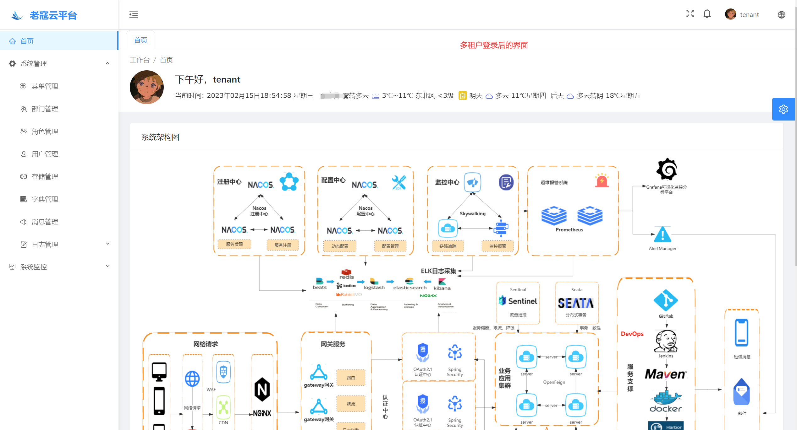
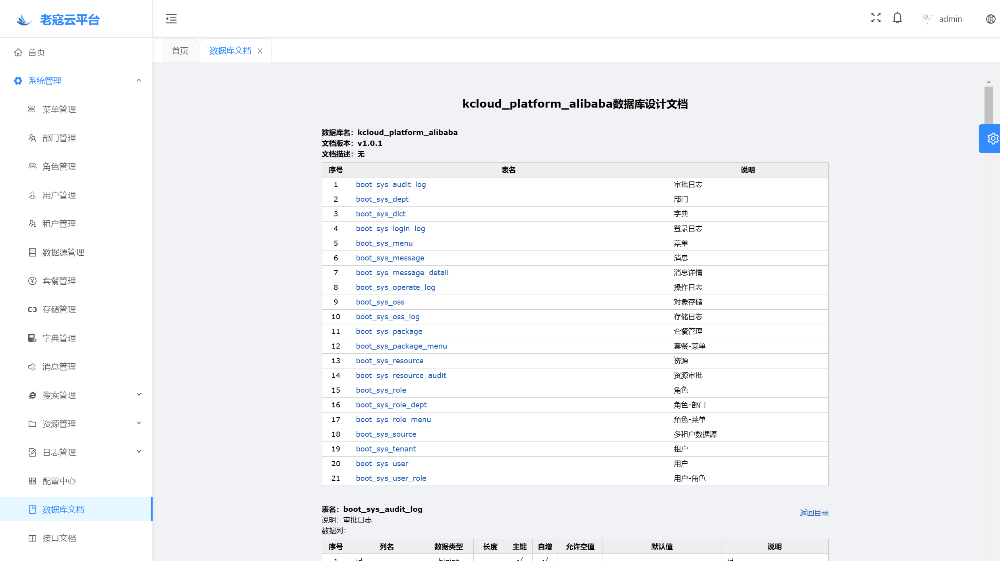
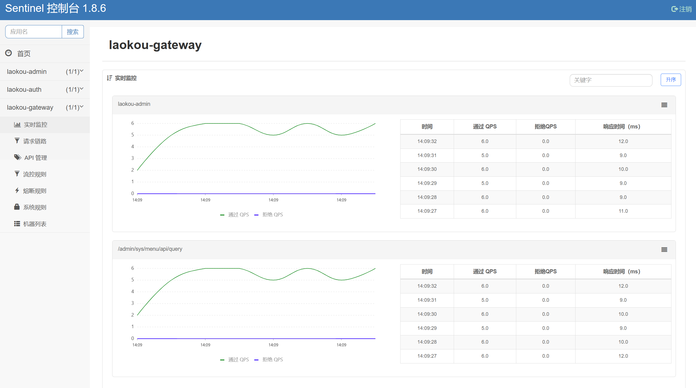
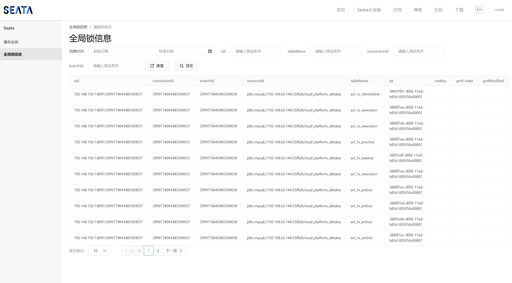

### 🎉 项目备注
项目：KCloud-Platform-Alibaba  
作者：老寇  
语言：Java  
职位：Java工程师   
时间：2022.06.15 ~ 至今  

### 📣 项目介绍
<p align="center"></p>
KCloud-Platform-Alibaba（老寇云平台）是一款企业级微服务架构的云服务平台。基于Spring Boot 3.0.5、Spring Cloud 2022.0.2、Spring Cloud Alibaba 2022.0.0.0-RC1 最新版本开发的多租户SaaS系统。
遵循SpringBoot编程思想，高度模块化和可配置化。具备服务注册&发现、配置中心、服务限流、熔断降级、监控报警、多数据源、工作流、高亮搜索、定时任务、分布式缓存、分布式事务、分布式存储等功能，用于快速构建微服务项目。目前支持Shell、Docker等多种部署方式，实现RBAC权限、其中包含系统管理、系统监控、工作流程、数据分析等几大模块。
遵循阿里代码规范，代码简洁、架构清晰，非常适合作为基础框架使用。
<p align="center">
    <a target="_blank" href="https://github.com/KouShenhai/KCloud-Platform-Alibaba"></a>
    <a target="_blank" href="https://github.com/KouShenhai/KCloud-Platform-Alibaba"></a>
    <a target="_blank" href="https://github.com/KouShenhai/KCloud-Platform-Alibaba"></a>
    <a target="_blank" href="https://github.com/KouShenhai/KCloud-Platform-Alibaba"></a>
	<a target="_blank" href="https://gitee.com/laokouyun/KCloud-Platform-Alibaba/stargazers"></a>
    <a target="_blank" href="https://gitee.com/laokouyun/KCloud-Platform-Alibaba"></a>
    <a target="_blank" href="https://spring.io/projects/spring-boot"></a>
    <a target="_blank" href="https://spring.io/projects/spring-cloud"></a>
    <a target="_blank" href="https://github.com/alibaba/spring-cloud-alibaba"></a>
    <a target="_blank" href="https://spring.io/projects/spring-authorization-server"></a>
    <a target="_blank" href="https://www.oracle.com/java/technologies/downloads/#java17"></a>
    <a target="_blank" href="https://jq.qq.com/?_wv=1027&k=Ec8T76dR"></a>
</p>

### 💞 演示地址
[http://175.178.69.253](http://175.178.69.253)  
系统账号   
admin/admin123  
test/test123  
laok5/test123  

系统租户   
tenant/tenant123

### 🔖 在线文档
[https://koushenhai.github.io](https://koushenhai.github.io)

### 💪 版本号
特此说明，与Spring Boot版本保持一致

### 🔎 功能介绍
🚀 用户管理：用户信息增删改查（字段隔离）（可重置密码）   
🚀 角色管理：角色信息增删改查，基于部门的数据权限、角色权限（字段隔离）     
🚀 菜单管理：菜单信息增删改查（字段隔离）（自定义菜单图标）   
🚀 部门管理：部门信息增删改查（字段隔离）    
🚀 日志管理：操作日志、登录日志查询、导出（字段隔离）       
🚀 字典管理：字典信息管理（数据库隔离）    
🚀 消息管理：消息提醒和消息通知（数据库隔离）    
🚀 搜索管理：通过关键字搜索并高亮显示（默认ES）    
🚀 流程定义：流程定义、挂起、激活、查看、删除（默认数据库）    
🚀 接口文档：Swagger2升级为Open Api Doc 3    
🚀 服务监控：服务内存监控及报警     
🚀 缓存监控：Redis内存监控    
🚀 主机监控：服务器内存或磁盘监控    
🚀 存储管理：存储信息增删改查，兼容Amazon S3（数据库隔离）    
🚀 租户管理：租户信息增删改查增删改查（默认数据库）       
🚀 套餐管理：自定义租户菜单增删改查（默认数据库）    
🚀 数据源管理：数据源信息增删改查（默认数据库）         
🚀 资源管理：视频、图片、音频信息增删改查，资源审批（Seata AT模式）、处理、转办、委派，审批日志，数据同步（批量同步到ES）（默认数据库）          
🚀 用户登录：账号密码（多租户）、手机号、邮件、授权码登录（请运行认证模式测试脚本.http）（同一个账号只能在一处登录，不然强制踢出）    

### 🚩 下个版本
🚀 统计报表：用户画像（未开发）         
🚀 代码生成器：（未开发）         
🚀 微信公众号管理：微信公众号一体化管理（未开发）        

### 💡 系统架构


### ✂ 技术体系

#### 🎯 Spring全家桶及核心技术版本
| 组件                          | 版本             |
|:----------------------------|:---------------|
| Spring Boot                 | 3.0.5          |
| Spring Cloud                | 2022.0.2       |
| Spring Cloud Alibaba        | 2022.0.0.0-RC1 |
| Spring Boot Admin           | 3.0.2          |
| Spring Authorization Server | 1.0.1          |
| Mybatis Plus                | 3.5.3.1        |
| Nacos                       | 2.2.0.1        |
| Seata                       | 1.6.1          |
| Sentinel                    | 1.8.6          |
| Mysql                       | 8.0.31         |
| Redis                       | 7.0.8          |
| Elasticsearch               | 8.6.2          |
| RocketMQ                    | 5.0.0          |
| Flowable                    | 7.0.0.M1       |
| ShardingSphere              | 5.3.2          |
| OpenResty                   | 1.21.4.1       |
| HBase                       | 2.5.3          |
#### 🍺 相关技术

- 配置中心&服务注册&发现：Nacos
- API网关：Spring Cloud Gateway
- 认证授权：Spring Security OAuth2 Authorization Server
- 服务消费：Spring Cloud OpenFeign & OkHttp & HttpClient & WebClient
- 负载均衡：Spring Cloud Loadbalancer
- 服务熔断&降级&限流：Sentinel
- 分库分表&读写分离：ShardingSphere
- 分布式事务：Seata
- 消息队列：RocketMQ
- 分布式数据库：HBase
- 服务监控：Spring Boot Admin & Prometheus
- 链路跟踪：SkyWalking
- 任务调度：Power Job
- 日志分析：EFK
- 负载均衡：OpenResty
- 多级缓存：Caffeine & Redis
- 统计报表：MongoDB
- 对象存储：Amazon S3
- 服务部署：Docker
- 持续集成&交付：Jenkins
- 持久层框架：Mybatis Plus
- JSON序列化：Jackson
- 数据库：Mysql
- 工作流：Flowable

#### 🌴 项目结构
~~~
├── laokou-common  
        └── laokou-common-log                      --- 日志组件  
        └── laokou-common-sms                      --- 短信组件  
        └── laokou-common-mail                     --- 邮箱组件  
        └── laokou-common-core                     --- 核心组件  
        └── laokou-common-cors                     --- 跨域组件  
        └── laokou-common-redis                    --- 缓存组件  
        └── laokou-common-kafka                    --- 消息组件  
        └── laokou-common-wechat                   --- 微信组件  
        └── laokou-common-pulsar                   --- 消息组件  
        └── laokou-common-swagger                  --- 文档组件  
        └── laokou-common-reptile                  --- 爬虫组件  
        └── laokou-common-mongodb                  --- 报表组件  
        └── laokou-common-graphql                  --- 查询组件  
        └── laokou-common-rocketmq                 --- 消息组件  
        └── laokou-common-power-job                --- 工作组件  
        └── laokou-common-freemarker               --- 模板组件  
        └── laokou-common-prometheus               --- 监控组件  
        └── laokou-common-elasticsearch            --- 搜索组件  
        └── laokou-common-bom                      --- 依赖版本库  
        └── laokou-common-i18n                     --- 国际化组件  
        └── laokou-common-tenant                   --- 多租户组件  
        └── laokou-common-easy-captcha             --- 验证码组件  
        └── laokou-common-oss                      --- 对象存储组件  
        └── laokou-common-api                      --- API调用组件  
        └── laokou-common-hbase                    --- 海量存储组件  
        └── laokou-common-banner                   --- Banner组件  
        └── laokou-common-dubbo                    --- 远程调用组件  
        └── laokou-common-jasypt                   --- 加密解密组件  
        └── laokou-common-security                 --- 认证授权组件  
        └── laokou-common-openfeign                --- 远程调用组件   
        └── laokou-common-easy-excel               --- 导入导出组件   
        └── laokou-common-clickhouse               --- 列式存储组件  
        └── laokou-common-data-cache               --- 数据缓存组件  
        └── laokou-common-data-filter              --- 数据过滤组件  
        └── laokou-common-redis-search             --- 高效搜索组件  
        └── laokou-common-mybatis-plus             --- 对象映射组件  
        └── laokou-common-dynamic-router           --- 动态路由组件  
        └── laokou-common-ip-region                --- IP归属地组件  
        └── laokou-common-neo4j                    --- 图形数据库组件  
        └── laokou-common-r2dbc                    --- 响应式数据库组件  
        └── laokou-common-sentinel                 --- 服务限流&熔断降级组件  
├── laokou-cloud  
        └── laokou-gateway                         --- API网关  
        └── laokou-monitor                         --- 服务监控  
        └── laokou-register                        --- 服务治理  
        └── laokou-seata                           --- 分布式事务  
├── laokou-service         
        └── laokou-generator                       --- 模板模块  
        └── laokou-auth                            --- 认证授权模块  
        └── laokou-admin                           --- 后台管理模块  
        └── laokou-report                          --- 数据分析模块  
        └── laokou-modlule         
                └── laokou-test                    --- 测试模块  
                └── laokou-im                      --- 即时通讯模块  
                └── laokou-flowable                --- 工作流程模块  
~~~

### 👍 Maven打包
```bash
mvn install -Dmaven.test.skip=true
```

### ⚡ 环境配置
#### 🐜 服务配置
```yaml
spring:
  # https://www.kancloud.cn/tracy5546/dynamic-datasource/2264611
  # 多数据源
  datasource:
    dynamic:
      primary: master
      datasource:
        master:
          type: com.zaxxer.hikari.HikariDataSource
          driver-class-name: com.mysql.jdbc.Driver
          url: jdbc:mysql://127.0.0.1:3306/kcloud_platform_alibaba?useUnicode=true&characterEncoding=UTF-8&useJDBCCompliantTimezoneShift=true&useLegacyDatetimeCode=false&serverTimezone=Asia/Shanghai&useSSL=false
          username: root
          password: 123456
          hikari:
            max-lifetime: 120000
            maximum-pool-size: 16
            minimum-idle: 16
  # redis
  data:
    redis:
      #主机
      host: 127.0.0.1
      #端口
      port: 6379
      #连接超时时长（毫秒）
      timeout: 6000ms 
# elasticsearch
elasticsearch:
  #主机
  host: 127.0.0.1:9200
  #节点
  cluster-name: elasticsearch-node
```

### 📖 分布式事务AT
#### 🍸 服务配置
```yaml
# seata
seata:
  config:
    type: nacos
    nacos:
      server-addr: 127.0.0.1:8848
      namespace: xxx-xxx-xxx-xx
      group: SEATA_GROUP
  registry:
    type: nacos
    nacos:
      namespace: xxx-xxx-xxx-xx
      group: SEATA_GROUP
      server-addr: 127.0.0.1:8848
  enabled: true
  tx-service-group: default_tx_group
  data-source-proxy-mode: AT
```


### 🌵 JDK版本兼容
##### 🌍 VM options配置
```shell script
--add-opens=java.base/java.lang=ALL-UNNAMED
```

### 👻 数据权限
##### ☁ 代码引入
```java
@Service
@RequiredArgsConstructor
public class SysUserApplicationServiceImpl implements SysUserApplicationService {
    
    private final SysUserService sysUserService;

    @Override
    @DataFilter(tableAlias = "boot_sys_user")
    public IPage<SysUserVO> queryUserPage(SysUserQO qo) {
        IPage<SysUserVO> page = new Page<>(qo.getPageNum(),qo.getPageSize());
        return sysUserService.getUserPage(page,qo);
    }
}
```

### 🔆 二级缓存
##### 🔧 代码引入
```java
public class SysUserApiController {
    @DataCache(name = "user", key = "#id")
    public HttpResult<SysUserVO> detail(@RequestParam("id") Long id) {
        return new HttpResult<SysUserVO>().ok(sysUserApplicationService.getUserById(id));
    }
}
```

##### ⚓ 代码引入
```shell
@Service
@Slf4j
@RequiredArgsConstructor
public class SysResourceApplicationServiceImpl implements SysResourceApplicationService {
    
    /**
     * 使用openfeign调用时,每个被调用服务都需要加 @Transactional
     */ 
    @Transactional(rollbackFor = Exception.class,propagation = Propagation.REQUIRES_NEW)
    @GlobalTransactional
    public Boolean insertResource(SysResourceAuditDTO dto) {
        log.info("分布式事务 XID:{}", RootContext.getXID());
        SysResourceDO sysResourceDO = ConvertUtil.sourceToTarget(dto, SysResourceDO.class);
        sysResourceDO.setEditor(UserUtil.getUserId());
        sysResourceService.save(sysResourceDO);
        Long id = sysResourceDO.getId();
        String instanceId = startTask(id, sysResourceDO.getTitle());
        dto.setResourceId(id);
        return insertResourceAudit(dto,instanceId);
    }
    
}
```

### ✈ 启动系统
- 1.必须启动Mysql、Redis
- 2.可选启动Sentinel、RocketMQ、ElasticSearch、MongoDB
- 3.将doc/config/dev目录下的zip压缩文件都导入Nacos
- 4.运行doc/db/db_init.sql（如果使用租户，需要运行doc/db/db_tenant_init.sql）
- 5.按顺序启动laokou-register(第一个启动)、laokou-seata、laokou-gateway、laokou-auth、laokou-admin（其他的服务根据实际情况启动）
- 6.使用flowable审批，第一次启动，需要在流程定义上传流程图（下载模板，然后上传即可）

### 😋 高可用系统构建
- [x] 严格遵循阿里规范，注重代码质量
- [x] 集群部署，减少单点故障
- [x] 服务限流
- [x] 超时和重试机制
- [x] 熔断机制
- [x] 异步调用
- [x] 多级缓存
- [x] 服务监控报警

### 🎵 项目截图
<table>
    <tr>
        <td></td>
        <td></td>
    </tr>
    <tr>
        <td></td>
        <td></td>
    </tr>
    <tr>
        <td></td>
        <td></td>
    </tr>
    <tr>
        <td></td>
        <td></td>
    </tr>
    <tr>
        <td></td>
        <td></td>
    </tr>
    <tr>
        <td></td>
        <td></td>
    </tr>
    <tr>
        <td></td>
        <td></td>
    </tr>
    <tr>
        <td></td>
        <td></td>
    </tr>
    <tr>
        <td></td>
        <td></td>
    </tr>
    <tr>
        <td></td>
        <td></td>
    </tr>
    <tr>
        <td></td>
        <td></td>
    </tr>
    <tr>
        <td></td>
        <td></td>
    </tr>
    <tr>
        <td></td>
        <td></td>
    </tr>
    <tr>
        <td></td>
        <td></td>
    </tr>
    <tr>
        <td></td>
        <td></td>
    </tr>
    <tr>
        <td></td>
        <td></td>
    </tr>
</table>

### 😛 用户权益
- 采用Apache2.0开源协议，并且承诺永不参与商业用途，仅供大家无偿使用（点个star，拜托啦~🙏）
- 采用Apache2.0开源协议，并且承诺永不参与商业用途，仅供大家无偿使用（点个star，拜托啦~🙏）
- 采用Apache2.0开源协议，并且承诺永不参与商业用途，仅供大家无偿使用（点个star，拜托啦~🙏）

### 😘 参与贡献
欢迎各路英雄好汉参与KCloud-Platform-Alibaba代码贡献，期待您的加入！  
Fork本仓库 新建 feat_xxx_环境_时间（如 feat_laokou_dev_20230116） 分支提交代码，新建Pull Request！  
我觉得没问题就会合并到主干分支，你也就成为正式贡献者啦！    

### 😻 开源协议
KCloud-Platform-Alibaba 开源软件遵循 [Apache 2.0 协议](https://www.apache.org/licenses/LICENSE-2.0.html) 请务必保留作者、Copyright信息  


### 👀 项目地址
Github 后端地址：[KCloud-Platform-Alibaba](https://github.com/KouShenhai/KCloud-Platform-Alibaba)  
Github 前端地址：[KCloud-Antdv-Alibaba](https://github.com/KouShenhai/KCloud-Antdv-Alibaba)  

Gtiee 后端地址：[KCloud-Platform-Alibaba](https://gitee.com/laokouyun/KCloud-Platform-Alibaba)  
Gitee 前端地址：[KCloud-Antdv-Alibaba](https://gitee.com/laokouyun/KCloud-Antdv-Alibaba)  

### 🐭 鸣谢组织
[Spring官网](https://spring.io)  
[阿里巴巴社区](https://github.com/alibaba/spring-cloud-alibaba)  
[人人社区](https://www.renren.io)   
[若依社区](https://www.ruoyi.vip)  
[苞米豆社区](https://baomidou.com/)  
[livk-cloud社区](https://gitter.im/livk-cloud/community)  

### 🐼 鸣谢个人
<a href="https://github.com/KouShenhai" class="mr-2" data-hovercard-type="user" data-hovercard-url="/users/KouShenhai/hovercard" data-octo-click="hovercard-link-click" data-octo-dimensions="link_type:self">
        
</a>
<a href="https://github.com/liang99" class="mr-2" data-hovercard-type="user" data-hovercard-url="/users/liang99/hovercard" data-octo-click="hovercard-link-click" data-octo-dimensions="link_type:self">
        
</a>
<a href="https://github.com/livk-cloud" class="mr-2" data-hovercard-type="user" data-hovercard-url="/users/livk-cloud/hovercard" data-octo-click="hovercard-link-click" data-octo-dimensions="link_type:self">
        
</a>

### 🐸 联系
博客：[https://kcloud.blog.csdn.net](https://kcloud.blog.csdn.net)    

邮箱：[2413176044@qq.com](https://mail.qq.com)  

QQ：[2413176044]( http://wpa.qq.com/msgrd?v=3&uin=2413176044&Site=gitee&Menu=yes)  

[](https://jq.qq.com/?_wv=1027&k=Ec8T76dR)
