### 📌 作者的话

即使KCloud-Platform-IoT有诸多瑕疵，也掩盖不住它的光芒。

它就像是作者的孩子一样，在作者的眼中，它就是趋于完美的存在！

### 🎉 项目备注

- 项目：KCloud-Platform-IoT
- 作者：老寇
- 语言：Java
- 时间：2022.06.15 ~ 至今

### 📣 项目介绍

<div style="text-align: center"></div>

KCloud-Platform-IoT（老寇IoT云平台）是一个企业级微服务架构的IoT云平台。基于Spring Boot 4.0.0、Spring Cloud 2025.1.0、Spring Cloud Alibaba 2025.0.0.0 最新版本开发的云服务多租户IoT平台。 遵循SpringBoot编程思想，使用阿里COLA应用框架构建，高度模块化和可配置化。具备服务注册&发现、配置中心、灰度路由、服务限流、熔断降级、监控报警、多数据源、高亮搜索、分布式任务调度、分布式链路、分布式缓存、分布式事务、分布式存储、分布式锁等功能，用于快速构建IoT微服务项目。目前支持Shell、Docker、Kubernetes等多种部署方式，并且支持GraalVM和虚拟线程。实现RBAC权限、其中包含系统管理、物联管理、系统监控、数据分析等几大模块。 遵循阿里代码规范，采用RESTFul设计风格及DDD(领域驱动设计)思想，代码简洁、架构清晰，非常适合作为基础框架使用。

<a href="https://github.com/KouShenhai/KCloud-Platform-IoT/actions/workflows/maven.yml" target="_blank"></a>
<a href="https://github.com/KouShenhai/KCloud-Platform-IoT/actions/workflows/node.js.yml" target="_blank"></a>
<a href="https://dl.circleci.com/status-badge/redirect/circleci/Bvmh1W3CkTV7xQCz5au73K/KgCR3Kb3gXzuxQP6YLKBUX/tree/master" target="_blank"></a>

<a href="https://app.deepsource.com/gh/KouShenhai/KCloud-Platform-IoT" target="_blank"></a>
<a href="https://app.deepsource.com/gh/KouShenhai/KCloud-Platform-IoT" target="_blank"></a>
<a href="https://app.codacy.com/gh/KouShenhai/KCloud-Platform-IoT/dashboard" target="_blank"></a>
<a href="https://www.codefactor.io/repository/github/KouShenhai/KCloud-Platform-IoT" target="_blank"></a>

<a href="https://github.com/KouShenhai/KCloud-Platform-IoT/stargazers" target="_blank"></a>
<a href="https://github.com/KouShenhai/KCloud-Platform-IoT/forks" target="_blank"></a>
<a href="https://github.com/KouShenhai/KCloud-Platform-IoT" target="_blank"></a>
<a href="https://github.com/KouShenhai/KCloud-Platform-IoT" target="_blank"></a>

<a href="https://gitee.com/laokouyun/KCloud-Platform-IoT/stargazers" target="_blank"></a>
<a href="https://gitee.com/laokouyun/KCloud-Platform-IoT/members" target="_blank"></a>

<a href="https://gitcode.com/qq_39893313/KCloud-Platform-IoT" target="_blank"></a>

<a href="https://spring.io/projects/spring-framework" target="_blank"></a>
<a href="https://spring.io/projects/spring-authorization-server" target="_blank"></a>
<a href="https://spring.io/projects/spring-boot" target="_blank"></a>
<a href="https://spring.io/projects/spring-cloud" target="_blank"></a>
<a href="https://github.com/alibaba/spring-cloud-alibaba" target="_blank"></a>

<a href="https://www.graalvm.org/downloads" target="_blank"></a>
<a href="https://maven.apache.org/" target="_blank"></a>

<a href="https://codecov.io/gh/KouShenhai/KCloud-Platform-IoT" target="_blank"></a>
<a href="https://cla-assistant.io/KouShenhai/KCloud-Platform-IoT" target="_blank"></a>
<a href="https://github.com/KouShenhai/KCloud-Platform-IoT" target="_blank"></a>
<a href="https://wakatime.com/projects/KCloud-Platform-IoT" target="_blank"></a>
[](https://deepwiki.com/KouShenhai/KCloud-Platform-IoT)

### 😋 项目背景

- 学习微服务架构设计并实践于生产
- 整合所学技术方便快速搭建项目
- 持续优化代码来提高代码质量
- 复制粘贴代码提高生产效率
- 学习DDD思想并落地实践
- 项目驱动学习任何知识

### 👉 项目定位
只适用于中大型微服务IoT项目【业务复杂】


### 📙 项目截图
|                                    |                                     |
|:----------------------------------:|:-----------------------------------:|
|    |     |
|  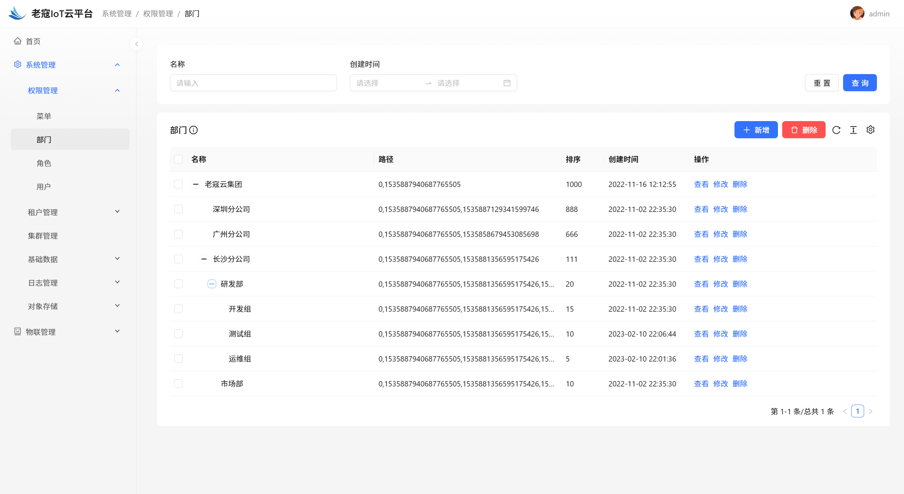  |  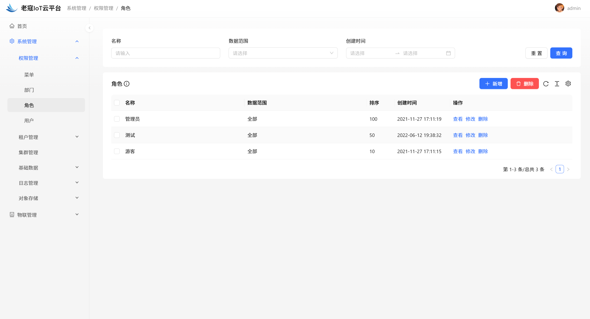   |
|  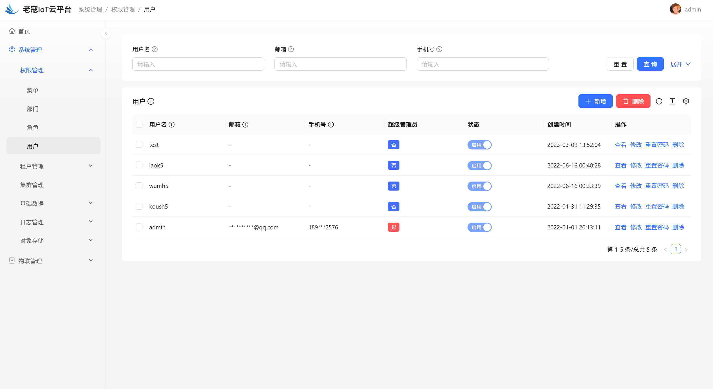  | 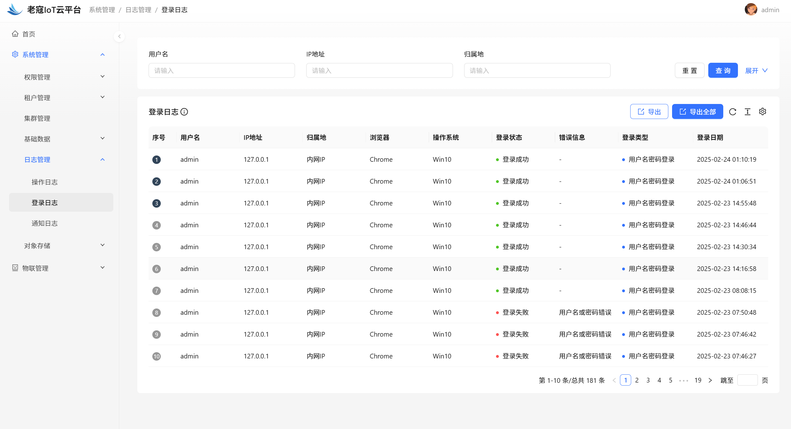  |
| 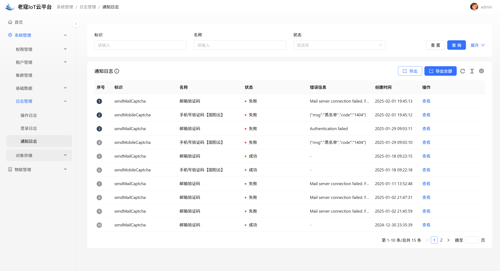 | 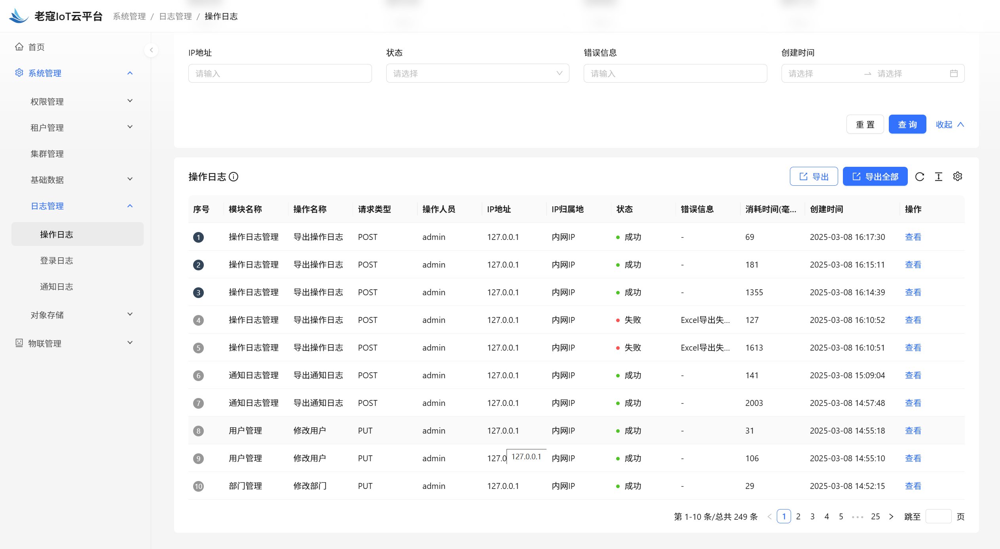  |
| 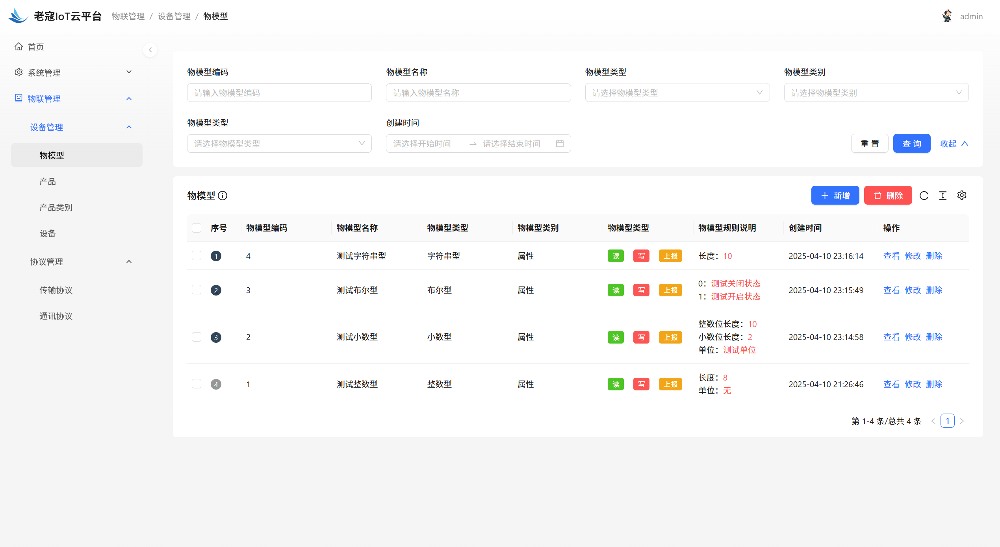  | 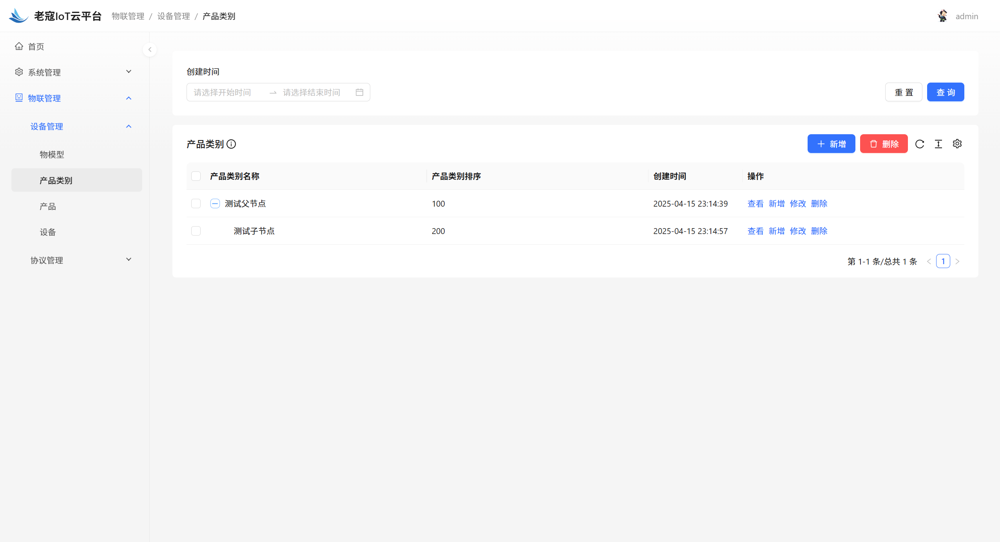 |

### 🌿 服务器配置

| 环境 |             配置              |  备注   |
|:--:|:---------------------------:|:-----:|
| 开发 | 32G【内存】&nbsp;&nbsp;512G【磁盘】 |   无   |
| 生产 | 16G【内存】&nbsp;&nbsp;40G【磁盘】  | 请搭建集群 |

### 🔗 在线体验

| 序号 |   租户   |  账号   |    密码    |
|:--:|:------:|:-----:|:--------:|
| 1  | laokou | admin | admin123 |

### 📏 开发测试

| 序号 |    租户     |  账号   |    密码    |
|:--:|:---------:|:-----:|:--------:|
| 1  | laokouyun | admin | admin123 |

[老寇IoT云平台在线体验（请点击我，境外服务器网络延迟请稍候）](https://www.laokou.org.cn)

### 🔖 在线文档

[老寇IoT云平台在线文档（请点击我）](https://koushenhai.github.io)

[DeepWiki文档](https://deepwiki.com/KouShenhai/KCloud-Platform-IoT)

[OpenDeepWiki文档](https://opendeep.wiki/KouShenhai/KCloud-Platform-IoT)

### 😎 开发计划

[开发计划（需要登录）](https://docs.qq.com/sheet/DUGhCdGVZWmVxT0VJ?tab=BB08J2)

### 💪 版本号

特此说明，与Spring Boot版本保持一致

### 🔎 功能介绍

🚀 登录【用户名密码/邮箱/手机号】

🚀 菜单管理【查询/新增/修改/删除/查看】

🚀 部门管理【查询/新增/修改/删除/查看】

🚀 角色管理【查询/新增/修改/删除/查看/分配权限】

🚀 用户管理【查询/新增/修改/删除/查看/上传头像/分配权限/重置密码】

🚀 操作日志/通知日志/登录日志【查询/查看/导出/导出全部】

🚀 物模型管理【查询/新增/修改/删除/查看】

🚀 产品类别管理【查询/新增/修改/删除/查看】

### 💡 系统架构

<div style="text-align: center"></div>
<div style="text-align: center">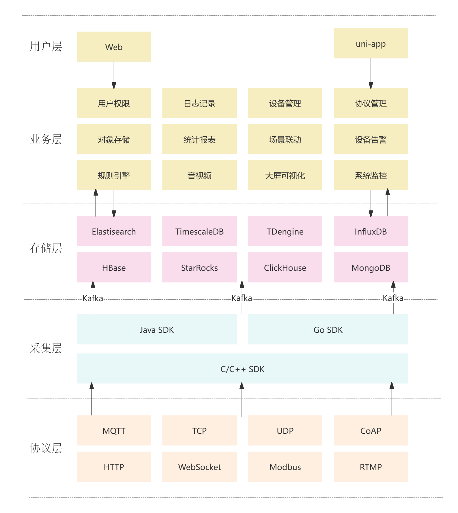</div>

### ✂ 技术体系

#### 🎯 Spring全家桶及核心技术版本

|          组件          |     版本      |
|:--------------------:|:-----------:|
|     Spring Boot      |    4.0.0    |
|   Spring Framework   |    7.0.1    |
|   Spring Security    |    7.0.0    |
|     Spring gRPC      |    1.0.0    |
|     Spring Data      |  2025.1.0   |
|     Spring Cloud     |  2025.1.0   |
| Spring Cloud Alibaba | 2025.0.0.0  |
|  Spring Boot Admin   |    3.5.6    |
|     Mybatis Plus     |   3.5.14    |
|        Nacos         |    3.1.0    |
|         gRPC         |   1.76.0    |
|        Redis         |    8.0.1    |
|    Elasticsearch     |    9.2.1    |
|        Netty         | 4.2.7.Final |
|        Kafka         |    4.0.0    |
|        Pulsar        |    4.0.5    |
|         EMQX         |    5.4.1    |
|        Pulsar        |    4.0.5    |
|     TimescaleDB      |     17      |
|       TDengine       |   3.3.5.0   |
|      Liquibase       |   4.30.0    |
|      Snail Job       |    1.8.0    |
|       Sentinel       |    1.8.9    |

#### 🍺 相关技术

- 配置中心&服务注册&发现：Nacos
- API网关：Spring Cloud Gateway
- 认证授权：Spring Security
- 远程调用：gRPC
- 客户端请求：OkHttp & HttpClient & WebClient & RestClient
- 负载均衡：Spring Cloud Loadbalancer
- 服务熔断&降级&限流：Sentinel
- 分库分表：Mybatis Plus
- 消息队列：Kafka & Pulsar
- 服务监控：Spring Boot Admin & Prometheus
- 高亮搜索：Elasticsearch
- 链路跟踪：Jaeger
- 任务调度：Snail Job
- 日志分析：EFK
- 缓存&分布式锁：Redis & Redisson
- 统计报表：MongoDB & StarRocks
- 对象存储：Amazon S3
- 自动化部署：Docker & Kubernetes
- 网络通讯：Netty
- 持续集成&交付：Jenkins
- 持久层框架：Mybatis Plus
- 序列化&反序列化：Jackson & Fory
- 数据库：Postgresql
- 时序数据库：TimescaleDB & TDengine & InfluxDB
- 数据库迁移：Liquibase
- 链路&指标采集：Micrometer
- 分布式ID：Zookeeper

#### 🌴 项目结构

```markdown
├── laokou-common
        └── laokou-common-xss                      --- XSS组件
        └── laokou-common-log                      --- 日志组件
        └── laokou-common-core                     --- 核心组件
        └── laokou-common-cors                     --- 跨域组件
        └── laokou-common-redis                    --- 缓存组件
        └── laokou-common-kafka                    --- 消息组件
        └── laokou-common-log4j2                   --- 日志组件
        └── laokou-common-tenant                   --- 租户组件
        └── laokou-common-algorithm                --- 算法组件
        └── laokou-common-prometheus               --- 监控组件
        └── laokou-common-openapi-doc              --- 文档组件
        └── laokou-common-rate-limiter             --- 限流组件
        └── laokou-common-elasticsearch            --- 搜索组件
        └── laokou-common-i18n                     --- 国际化组件
        └── laokou-common-sensitive                --- 敏感词组件
        └── laokou-common-lock                     --- 分布式锁组件
        └── laokou-common-trace                    --- 链路跟踪组件
        └── laokou-common-nacos                    --- 注册发现组件
        └── laokou-common-netty                    --- 网络通讯组件
        └── laokou-common-domain                   --- 领域事件组件
        └── laokou-common-crypto                   --- 加密解密组件
        └── laokou-common-secret                   --- 接口验签组件
        └── laokou-common-security                 --- 认证授权组件
        └── laokou-common-snail-job                --- 任务调度组件
        └── laokou-common-data-cache               --- 数据缓存组件
        └── laokou-common-mybatis-plus             --- 对象映射组件
        └── laokou-common-tdengine                 --- 时序数据库组件
├── laokou-cloud
        └── laokou-nacos                           --- 服务治理
        └── laokou-gateway                         --- API网关
        └── laokou-monitor                         --- 服务监控
├── laokou-service
        └── laokou-iot                             --- 物联网模块
        └── laokou-auth                            --- 认证授权模块
        └── laokou-admin                           --- 后台管理模块
        └── laokou-report                          --- 报表统计模块
        └── laokou-logstash                        --- 日志收集模块
        └── laokou-generator                       --- 模板生成模块
```

### 🔒 安全报告

<a href="https://www.murphysec.com/console/report/1717540049993383936/1810494453766979584" target="_blank"></a>

### 👊 性能评测

[请点击我，查看详情](性能测试.adoc)

### 😝 贡献者许可协议

[贡献者许可协议](https://cla-assistant.io/KouShenhai/KCloud-Platform-IoT)

### 😛 用户权益（点个Star，拜托啦~🙏）

- Apache2.0开源协议，请保留作者、Copyright信息，否则视为侵权【免费用于毕设、二开、商用、二次开源】
- Apache2.0开源协议，请保留作者、Copyright信息，否则视为侵权【免费用于毕设、二开、商用、二次开源】
- Apache2.0开源协议，请保留作者、Copyright信息，否则视为侵权【免费用于毕设、二开、商用、二次开源】

### 😻 开源协议

KCloud-Platform-IoT 开源软件遵循 [Apache 2.0 协议](https://www.apache.org/licenses/LICENSE-2.0.html) 请务必保留作者、Copyright信息

### 🐮 二次开源登记（Apache2.0开源协议，请保留作者、Copyright信息）

| 序号 |                              Github项目                               |                              Gitee项目                               |
|:--:|:-------------------------------------------------------------------:|:------------------------------------------------------------------:|
| 1  | [xht-cloud-platform](https://github.com/xhtcode/xht-cloud-platform) | [xht-cloud-platform](https://gitee.com/xhtrepo/xht-cloud-platform) |


### 🔧 参与贡献

[请点击我，查看规范](CONTRIBUTING.adoc)

### 👀 项目地址

[Github 地址](https://github.com/KouShenhai/KCloud-Platform-IoT)

[Gitee 地址](https://gitee.com/laokouyun/KCloud-Platform-IoT)

### 🙋 技术分享【请关注公众号加技术群】


### 🐭 鸣谢组织

[Spring社区](https://spring.io)

[Jetbrains社区](https://www.jetbrains.com/community)

[阿里巴巴社区](https://github.com/alibaba)

[苞米豆社区](https://baomidou.com)

[livk-cloud社区](https://gitter.im/livk-cloud/community)

[laokouyun社区](https://github.com/laokouyun)

非常感谢 Jetbrains 提供的开源 License

<a target="_blank" href="https://www.jetbrains.com/community/opensource/?utm_campaign=opensource&utm_content=approved&utm_medium=email&utm_source=newsletter&utm_term=jblogo#support"></a>

### 🌞 开源512（感谢各位大佬）

开源三年的旅程，我们共同跨越了无数技术鸿沟与成长阵痛。衷心感谢每一位代码贡献者的智慧结晶，感恩行业前辈的悉心指导，感激社区伙伴的温暖陪伴。是你们的每一次commit、每一条issue、每一份star，让这个开源项目在风雨中绽放出耀眼的光芒。

值此开源三周年之际，我们准备了承载心意的特别礼物。感谢10位贡献者的代码筑城，致敬40个开源先驱项目的火炬传递，珍藏社区累计900次的温暖互动。每一份实体礼物都将镌刻您的GitHub ID，这不仅是致谢，更是属于技术人的浪漫勋章。

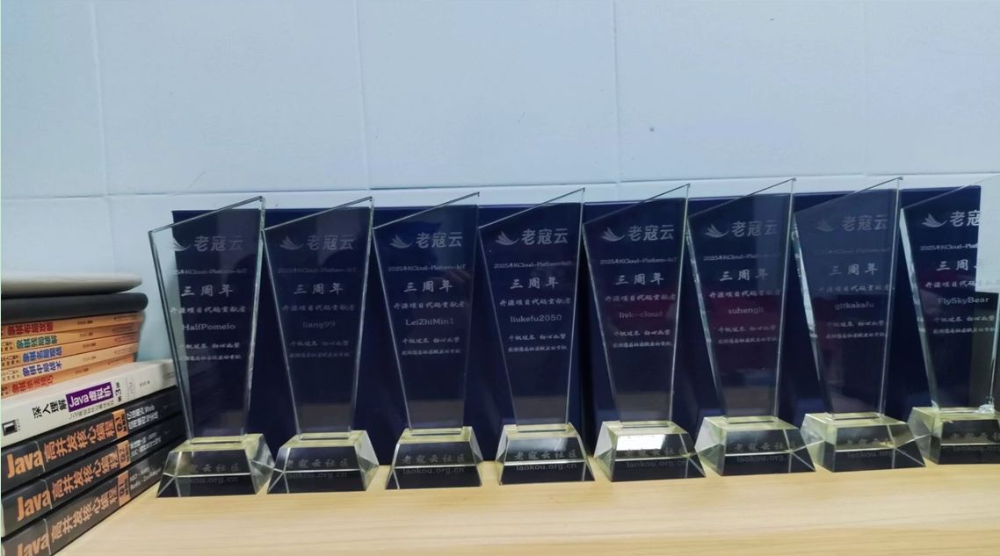

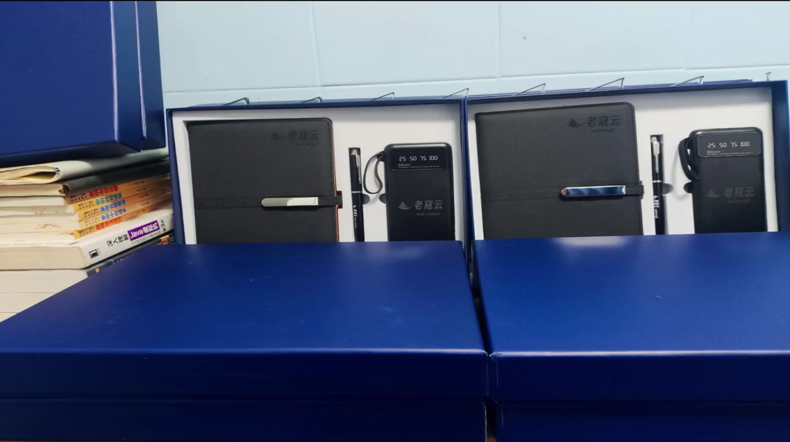

[抖音视频-老寇IoT云平台开源三周年](https://v.douyin.com/7tquJphUnAI)

[哔哩哔哩视频-老寇IoT云平台开源三周年](https://www.bilibili.com/video/BV1KPdxYaESL)

### 🎁 荣誉称号

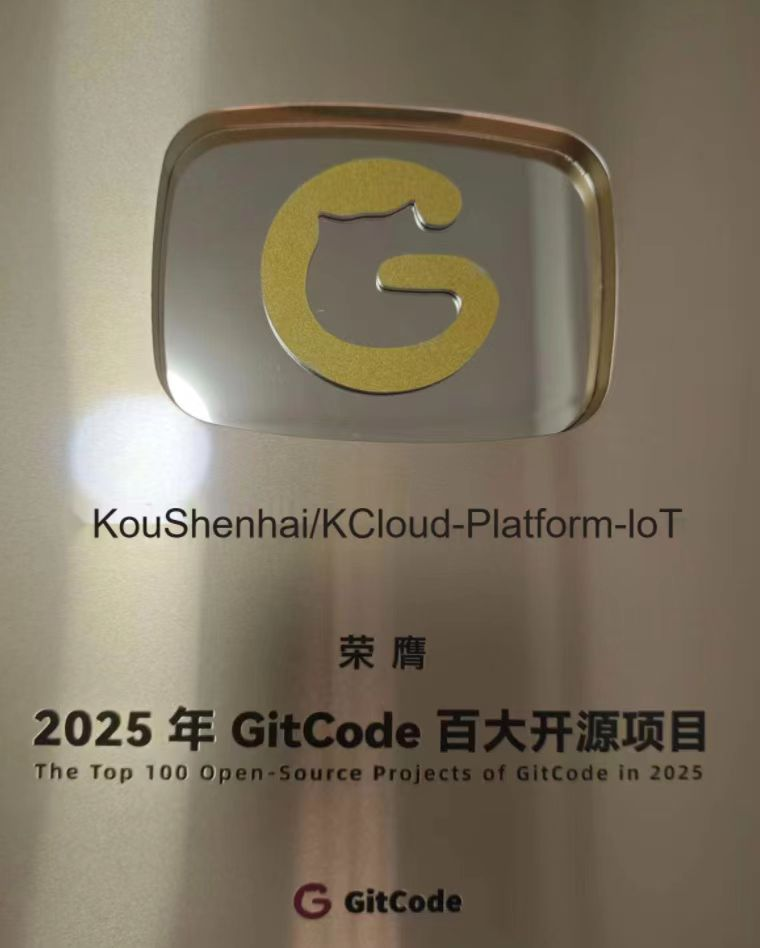

[抖音视频-GitCode百大开源项目获奖感谢](https://v.douyin.com/fhQd0Bp8f40)

[哔哩哔哩视频-GitCode百大开源项目获奖感谢](https://www.bilibili.com/video/BV1zeCCBcEn5)

### 🐼 鸣谢个人

| 序号 |                                       头像                                       |                       名字                        |
|:--:|:------------------------------------------------------------------------------:|:-----------------------------------------------:|
| 1  |     |   [KouShenhai](https://github.com/KouShenhai)   |
| 2  |        |      [liang99](https://github.com/liang99)      |
| 3  |     |   [livk-cloud](https://github.com/livk-cloud)   |
| 4  |    |  [liukefu2050](https://github.com/liukefu2050)  |
| 5  |     |   [HalfPomelo](https://github.com/HalfPomelo)   |
| 6  |          |        [lixin](https://github.com/lixin)        |
| 7  |          |       [simman](https://github.com/simman)       |
| 8  |       |     [suhengli](https://github.com/suhengli)     |
| 9  |      |    [gitkakafu](https://github.com/gitkakafu)    |
| 10 |     |   [LeiZhiMin1](https://github.com/LeiZhiMin1)   |
| 11 |     |   [FlySkyBear](https://github.com/FlySkyBear)   |
| 12 |  | [sd-xiaoZheng](https://github.com/sd-xiaoZheng) |
### ⛳️ 赞助列表（感谢各位大佬的赞助）

|     时间     |  网名   |   赞助    |         备注         |
|:----------:|:-----:|:-------:|:------------------:|
| 2025/06/11 |  路*   | ￥20.00  |       感谢开源~        |
| 2025/01/25 |  擎*   | ￥20.00  |        请喝咖啡        |
| 2024/12/08 |  t*   | ￥199.00 |         无          |
| 2024/12/02 |  'c*  | ￥399.00 |         无          |
| 2024/11/25 | tio*  | ￥520.00 | 希望KCloud飞起，实现专精特新! |
| 2024/08/01 | *ckai | ￥88.00  |        加油~         |
| 2024/04/19 |  *保熟  | ￥188.00 |        越做越好        |
| 2024/03/20 | A细节*  | ￥66.00  |         无          |
| 2024/03/03 |  y*i  | ￥58.88  |         无          |
| 2024/01/30 |  *阳   |   ￥10   |         无          |
| 2023/12/22 |  *民   |   服务器   |         无          |
| 2023/12/08 |  *来   |   ￥10   |   希望越来越好，一直坚持下去    |
| 2023/12/08 |  *迪   |   ￥20   |     越来越好，继续干下去     |
| 2023/10/07 |  何*   |  ￥399   |      作者说：感谢支持      |
| 2023/08/27 |  *界   |   ￥10   |       希望越来越好       |
| 2023/06/29 |   顺   |   ￥20   |    希望项目一直做下去就好     |
| 2023/03/27 |  s*e  |   ￥10   |         无          |

### 🚫 免责声明

禁止使用本项目从事一切违法犯罪活动。作者不承担任何法律责任，特此声明

### 🐸 联系作者

[博客：https://kcloud.blog.csdn.net](https://kcloud.blog.csdn.net)

[邮箱：2413176044@qq.com](https://mail.qq.com)

[QQ：2413176044](http://wpa.qq.com/msgrd?v=3&uin=2413176044&Site=gitee&Menu=yes)


