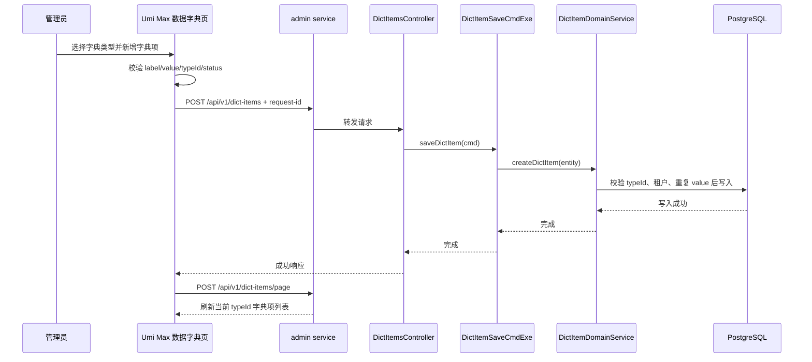

## Context

当前仓库已经存在一部分数据字典基础设施：

- 后端 `laokou-service/laokou-admin` 已按 DDD COLA 分层提供 `dict` 和 `dictItem` 的 controller、service、command、domain、gateway、mapper、DO/CO/DTO。
- 前端 `ui/src/services/admin` 已生成 `dict.ts` 和 `dictItem.ts`，但 `ui/config/routes.ts` 没有挂载 `/sys/base/dict` 页面，`ui/src/access.ts` 也没有 `sys:dict:*` 与 `sys:dict-item:*` 权限映射。
- 数据库脚本中已有 `sys_dict`、`sys_dict_item`、`/sys/base/dict` 菜单和部分权限资源；实现时需要校验初始化数据是否完整、幂等、与当前前端路由一致。

本变更应优先复用现有结构，补齐缺口，并避免引入新的服务、消息主题或前端状态库。

## Goals / Non-Goals

**Goals:**

- 让管理端可以完整使用数据字典：字典类型和字典项的查询、查看、新增、修改、删除、导入、导出。
- 保持 Umi Max、Ant Design Pro、`useAccess`、`useIntl`、`ProTable`、`DrawerForm` 的现有页面模式。
- 保持后端 API 路径兼容，沿用 `laokou-admin` 的 DDD COLA 分层。
- 加固后端请求校验、唯一性、租户隔离、字典项归属和删除保护。
- 补齐数据库初始化/迁移、权限和国际化菜单数据。

**Non-Goals:**

- 不新增独立微服务，不拆分 `laokou-admin`。
- 不引入 Kafka、Pulsar、MQTT、TDengine 或 IoT 遥测链路。
- 不改变已有 `/api/v1/dicts*` 和 `/api/v1/dict-items*` API 路径。
- 不实现业务模块读取字典缓存的通用 SDK；本次聚焦管理闭环。

## Decisions

### 1. 前端采用单路由主从工作台

在 `/sys/base/dict` 新增一个数据字典页面，页面内同时管理字典类型和字典项。字典类型作为主表，选中一条字典类型后，字典项表按 `typeId` 加载对应数据。宽屏使用左右或上下主从布局，窄屏自然堆叠。

备选方案是拆成 `/sys/base/dict` 和 `/sys/base/dictItem` 两个路由。该方案会增加菜单和导航成本，也容易让用户脱离当前字典类型上下文，因此不采用。

### 2. 前端复用现有 generated services，但先校正调用细节

页面复用 `ui/src/services/admin/dict.ts`、`dictItem.ts`。实现时需要确认：

- 开发代理是否要求统一使用 `/api-proxy/admin/api/v1/...` 前缀，避免字典 service 与其他 admin service 路径不一致。
- 导入接口后端使用 `@RequestPart("files")`，前端 FormData 字段名必须匹配 `files`，不能误用 `file`。
- 新增接口带 `request-id`，保持现有 `uuidV7()` 幂等模式。
- 导出优先复用 `ui/src/utils/export.ts` 的 blob 下载模式，或按现有 service 返回结构封装。

### 3. 后端沿用现有 COLA 分层并补业务校验

不重建模块。校验落在现有 `dict` 与 `dictItem` 包内：

- `adapter` 层保持权限、日志、幂等和 `Result<Page<...>>` 契约。
- `client` 层为 `DictCO`、`DictItemCO`、`*SaveCmd`、`*ModifyCmd` 补必要字段约束，或按项目当前校验风格在 command/domain 层集中校验。
- `app` 层 command executor 负责事务边界和调用领域服务。
- `domain` 层表达业务规则：字典类型唯一、字典项归属有效、同类型字典项值唯一、删除保护。
- `infrastructure` 层 mapper/gateway 负责查询重复、查询归属、统计子项、持久化和软删除。

### 4. 删除字典类型默认采用保护式删除

当字典类型下存在未删除字典项时，默认拒绝删除并提示先删除或停用字典项。这个策略比级联删除更适合管理后台基础数据，能降低误删配置项导致业务页面枚举值异常的风险。

备选方案是受控级联删除。它交互更快，但误操作影响面更大，除非后续产品明确要求，否则不作为默认策略。

### 5. 数据库迁移采用幂等补齐

优先补齐缺失的菜单、权限、国际化文案和必要索引。对唯一索引或约束的新增要先检测重复数据，迁移脚本应可重复执行，并且回滚不删除已有业务字典数据。

## Service Interaction

```mermaid
flowchart LR
  UI["Umi Max 数据字典页"] --> SVC["admin dict/dictItem service"]
  SVC --> GW["Gateway / api-proxy"]
  GW --> CTRL["laokou-admin adapter Controller"]
  CTRL --> APP["app ServiceImpl / CommandExe"]
  APP --> DOM["domain DictDomainService / DictItemDomainService"]
  DOM --> GATE["infrastructure GatewayImpl"]
  GATE --> MAP["MyBatis Plus Mapper"]
  MAP --> DB["PostgreSQL sys_dict / sys_dict_item"]
```

## Data Flow

本变更不产生 Kafka、Pulsar、MQTT 消息，不定义新的消息主题。

## Risks / Trade-offs

- [Risk] 现有字典 service 路径与其他 admin service 代理前缀不一致 -> 实现时统一核对 `proxy.ts`、网关路径和运行环境，必要时修正 generated service 或封装页面调用。
- [Risk] 已有数据库中可能存在重复 `type` 或重复字典项 `value` -> 新增唯一约束前先查询并清理重复数据，迁移脚本保持可回滚。
- [Risk] 后端当前领域服务偏透传，新增业务校验可能影响已有 API 调用 -> 保持 API 路径和响应结构不变，只对非法数据返回业务错误。
- [Risk] 导入文件字段名与后端 `files` 不一致导致导入失败 -> 前端上传字段名与 controller 保持一致，并补手工/自动化验证。
- [Risk] 单页面主从布局信息密度较高 -> 使用 ProTable 工具栏、可折叠搜索和抽屉表单，保证移动端堆叠可用。

## Migration Plan

1. 检查 `doc/db/kcloud_platform.sql` 和 Nacos/初始化脚本中 `sys_dict`、`sys_dict_item`、`sys_menu`、`sys_i18n_menu`、权限资源是否完整。
2. 如缺失，新增幂等迁移数据：`/sys/base/dict` 路由、`menu.sys.base.dict` 文案、`sys:dict:*` 和 `sys:dict-item:*` 权限。
3. 如新增唯一索引，先提供重复数据检查脚本，再创建索引。
4. 部署顺序：后端校验与迁移先发布，前端页面后发布；旧 API 路径继续可用。
5. 回滚时移除前端路由和页面入口，后端回滚新增校验代码；数据库不删除已有字典业务数据，必要时只回滚新增约束或初始化菜单权限。

## Open Questions

- 导入导出的 Excel/CSV 模板是否已有统一规范；实现时应优先复用项目现有导入导出格式。
- 若某字典类型已被其他业务模块引用，是否需要在删除保护中增加引用检查；本次先保护字典项层级，业务引用检查可作为后续增强。
