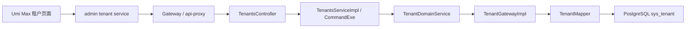
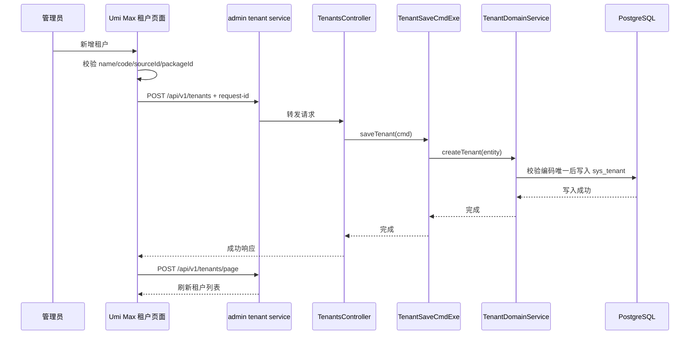

## Context

仓库中租户能力已经存在一部分基础设施：

- 后端 `laokou-service/laokou-admin` 已有 `TenantsController`、`TenantsServiceI`、command executor、`TenantDomainService`、`TenantGateway`、`TenantGatewayImpl` 和 `TenantCO/TenantE`。
- 通用租户模块 `laokou-common/laokou-common-tenant` 提供 `TenantDO`、`TenantMapper` 和 `mapper/tenant/TenantMapper.xml`，当前分页查询只返回全部未删除租户，未支持名称、编码、时间范围过滤。
- 前端 `ui/src/services/admin/tenant.ts` 已生成，但 `importTenant` 使用 `file` 字段，后端 controller 要求 `@RequestPart("files")`；`typings.d.ts` 中租户编码字段误生成为 `label`，与后端 `code` 不一致。
- 前端 `ui/config/routes.ts` 和 `ui/src/access.ts` 未挂载租户页面，也未补齐 `sys:tenant:*` 权限映射。
- `doc/db/kcloud_platform.sql` 已包含 `sys_tenant` 表、`/sys/tenant` 与 `/sys/tenant/index` 菜单、国际化菜单文案和租户权限资源数据，需要实现时核对路径与权限 key 是否一致。

本变更优先复用现有 DDD COLA 和 Ant Design Pro 页面模式，补齐可用闭环，不引入新服务、新状态库或新消息主题。

## Goals / Non-Goals

**Goals:**

- 让管理员可以在管理端完成租户分页查询、详情查看、新增、修改、删除、导入和导出。
- 保持 Umi Max、React 函数组件、TypeScript、Ant Design Pro、`useAccess`、`useIntl`、`ProTable`、`DrawerForm` 的现有写法。
- 保持后端 `/api/v1/tenants*` API 路径兼容，并按 DDD COLA 分层补齐领域规则。
- 保证租户名称、编码、数据源 ID、套餐 ID 的基础校验，保证租户编码唯一。
- 保护默认租户，避免删除平台内置租户导致登录、权限或数据隔离基础数据损坏。

**Non-Goals:**

- 不拆分新的租户微服务，不改变 `laokou-admin` 服务边界。
- 不实现租户套餐、数据源、部门、用户的跨模块联动配置页面；本次仅保存已有 `sourceId` 和 `packageId` 标识字段。
- 不新增 Kafka、Pulsar、MQTT、TDengine 或 IoT 设备侧流程。
- 不重构 OpenAPI 生成链路；只修正当前租户服务和类型中的契约不一致。

## Decisions

### 1. 前端使用单表租户管理页

新增 `ui/src/pages/Sys/Tenant/index.tsx` 和 `TenantDrawer.tsx`，路由挂载为 `/sys/tenant/index`，与数据库菜单初始化数据保持一致。页面使用单个 `ProTable` 管理租户基础信息，抽屉表单负责新增、查看、修改。

备选方案是放到 `/sys/base/tenant` 或与部门/用户页面合并。该方案会偏离已有数据库菜单路径，也会把租户这种平台级主数据混入权限组织结构，因此不采用。

### 2. 后端沿用已有 tenant COLA 分层并补规则

不重新生成模块。校验落在 `TenantDomainService`，持久化查询落在 `TenantGatewayImpl` 和 `TenantMapper.xml`：

- `client` 层保持 `TenantCO` 为页面和 API 的数据契约，补必要 Bean Validation 或通过领域服务集中校验。
- `app` 层 command executor 保持事务边界。
- `domain` 层负责租户不能为空、ID 合法、名称/编码长度、数据源/套餐 ID 非负、编码唯一、租户存在、删除保护等业务规则。
- `infrastructure/common-tenant` 层负责唯一性、存在性、分页过滤和乐观锁版本查询。

### 3. 租户编码使用全局唯一

租户编码用于多租户识别和登录/网关上下文解析，系统 MUST 保证未删除租户中 `code` 全局唯一。新增或修改时排除自身 ID 后检查重复编码。

备选方案是租户编码按当前租户范围唯一，但这会让平台管理租户自身时出现歧义，不适合租户主数据。

### 4. 默认租户采用保护式删除

ID 为 `1` 的默认租户和 `code = laokouyun` 的内置租户不可删除。批量删除中包含默认租户时整体拒绝，避免基础数据被部分删除后留下难排查的状态。

备选方案是允许超级管理员删除默认租户。该方案风险过高，且当前权限模型中没有显式区分此类高危操作，因此不采用。

### 5. 导入导出先接通入口，保持当前后端占位

当前 tenant 的 `TenantImportCmdExe` 和 `TenantExportCmdExe` 仍是生成器占位。前端提供入口并修正 multipart 字段为 `files`，后端保持接口契约；具体 Excel 模板和流式下载可作为后续增强。

## Service Interaction

## Data Flow

本变更不产生 Kafka、Pulsar、MQTT 消息，不定义新的消息格式。

## Risks / Trade-offs

- [Risk] 前端 `TenantCO.label` 与后端 `TenantCO.code` 不一致 -> 修正前端类型和页面字段，保持请求体使用 `code`。
- [Risk] `TenantMapper.xml` 当前使用 `${pageQuery.pageSize}` 和 `${pageQuery.pageIndex}` -> 本次优先沿用项目现状并补过滤条件，后续可统一治理 SQL 参数化。
- [Risk] 现有数据库可能已有重复 `code` 的未删除租户 -> 新增唯一约束前必须先检查重复；本次先在领域层拦截新增/修改重复。
- [Risk] 导入导出后端仍为占位 -> 前端入口可见但后端不会生成实际文件；任务中会验证当前接口契约，完整 Excel 能力另行增强。
- [Risk] 默认租户删除保护可能阻止某些测试清库操作 -> 提供明确业务错误，测试环境如需清理应走数据库重置脚本而非业务接口。

## Migration Plan

1. 校验 `doc/db/kcloud_platform.sql` 中 `sys_tenant` 表、默认租户、`/sys/tenant/index` 菜单、`menu.sys.tenant.*` 文案和 `sys:tenant:*` 权限资源。
2. 如缺失，补齐幂等初始化脚本或主初始化数据；不要删除已有租户业务数据。
3. 部署顺序：后端校验和 mapper 查询先发布，前端页面后发布；旧 API 路径继续可用。
4. 回滚时移除前端路由和页面入口，回滚后端新增校验；数据库仅回退本次新增菜单/权限/约束，不删除租户表中的业务数据。

## Open Questions

- 租户导入导出的 Excel 模板是否需要和生成器统一格式对齐；本次先保留接口入口和 multipart 契约。
- 删除租户是否需要检查用户、部门、角色、IoT 设备等跨模块引用；本次先保护默认租户和存在性，跨模块引用检查作为后续增强。
