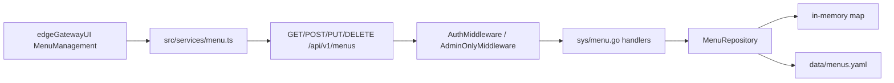
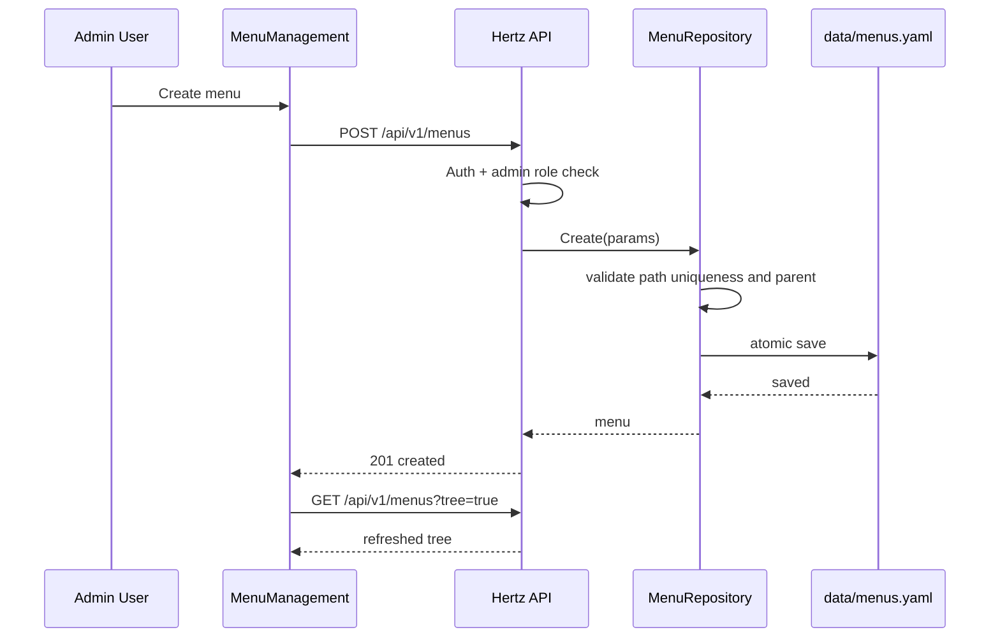

## Context

`KEdge-Gateway` 是轻量级 Go 边缘服务，使用 CloudWeGo Hertz 暴露 REST API，JWT 负责认证。当前仓库已经存在用户管理模块：

- `internal/model/user.go` 定义用户模型和安全响应模型。
- `internal/repository/user.go` 使用内存 map + `sync.RWMutex` + YAML 文件持久化，并在启动时初始化默认 admin 用户。
- `internal/api/sys/user.go` 暴露用户 CRUD API，复用 `respondOK`、`respondCreated`、`respondError` 响应格式。
- `internal/api/router.go` 已区分公开路由、认证路由和 admin-only 路由。
- `edgeGatewayUI` 使用 Umi Max、React 19、Ant Design Pro，已有 `UserManagement` 页面和 `services/user.ts`。

菜单管理应复用上述轻量架构，不引入数据库，不修改主平台 Java 服务。

## Goals / Non-Goals

**Goals:**

- 实现边缘网关本地菜单 CRUD、启停、树形查询和默认菜单初始化。
- 菜单数据持久化到 `data/menus.yaml`，启动时加载，文件不存在时创建默认菜单。
- 提供 Go/Hertz REST API，读接口需要 JWT 认证，写接口需要 admin 角色。
- 前端提供菜单管理页面，支持列表/树形展示、新建、编辑、删除、启停和关键字搜索。
- 保持和现有用户管理的响应结构、错误处理、权限控制和前端页面风格一致。

**Non-Goals:**

- 不实现复杂 RBAC、按钮级权限、动态路由热更新或多边缘节点同步。
- 不引入 SQLite、PostgreSQL、BoltDB 等本地数据库。
- 不替换 Umi Max 静态路由系统；本次菜单管理维护的是边缘网关本地菜单配置数据。
- 不改造主平台 `ui` 或 Java 后端。

## Decisions

### 1. 菜单存储采用内存 Map + YAML 持久化

菜单规模通常很小，YAML 足够透明、易排查、无额外部署依赖。仓储启动时从 `data/menus.yaml` 加载；写操作在内存锁内更新后原子写文件，沿用用户仓储的 temp file + rename 模式。

备选方案是 SQLite 或 BoltDB。它们更适合复杂查询和事务，但会增加边缘节点部署和交叉编译成本，因此不采用。

### 2. 菜单模型兼容前端路由字段

菜单模型包含：

- `id`
- `name`
- `path`
- `icon`
- `parentId`
- `sort`
- `status`，`enabled` 或 `disabled`
- `createdAt`
- `updatedAt`

`parentId` 为空表示根菜单。后端提供树形响应，前端可直接用 `ProTable` 的树形数据展示。

### 3. 写操作 admin-only，读操作 authenticated

查询菜单需要登录用户，创建、修改、删除、启停菜单需要 admin 角色。该策略复用现有 `AuthMiddleware` 和 `AdminOnlyMiddleware`，不新增权限体系。

### 4. 删除采用保护式策略

存在子菜单时拒绝删除父菜单，避免出现孤儿菜单。修改父级时校验父菜单存在，并拒绝将菜单挂到自己或自己的后代下。

### 5. 前端使用 ProTable + ModalForm

页面新增到 `/menus`，使用 `PageContainer`、`ProTable`、`ModalForm`、`Popconfirm` 和 `Badge/Tag`。此模式与 `UserManagement` 对齐，便于用户在边缘管理端快速理解。

## Service Interaction

## Data Flow

本变更不使用 Kafka、RabbitMQ、Pulsar 或 MQTT 消息，也不定义新的消息格式。

## Risks / Trade-offs

- [Risk] YAML 文件并发写损坏 -> 使用仓储写锁和 temp file + rename 原子写。
- [Risk] 删除父菜单导致孤儿数据 -> 后端拒绝删除存在子菜单的菜单。
- [Risk] 修改父级造成循环树 -> 后端检测自身和后代，拒绝循环父子关系。
- [Risk] 动态菜单与 Umi 静态路由不完全一致 -> 本次仅管理本地菜单配置，不承诺运行时动态注入路由。
- [Risk] 默认菜单初始化覆盖用户配置 -> 仅在 `data/menus.yaml` 不存在时初始化，存在时只加载不覆盖。

## Migration Plan

1. 后端新增模型、仓储、API handler，并在启动时调用 `InitDefaultMenus("data/menus.yaml")`。
2. 路由注册 `/api/v1/menus*`，读接口 JWT 认证，写接口 admin-only。
3. 前端新增 `/menus` 路由和页面，admin 角色显示入口。
4. README 记录默认菜单、数据文件路径和 API。
5. 回滚时移除后端菜单路由和前端路由；保留 `data/menus.yaml` 不影响已有用户、设备和登录能力。

## Open Questions

- 是否后续要把菜单数据用于运行时动态路由渲染；本次先提供配置管理能力。
- 是否要扩展按钮权限或 API 权限资源；本次只做菜单级管理。
