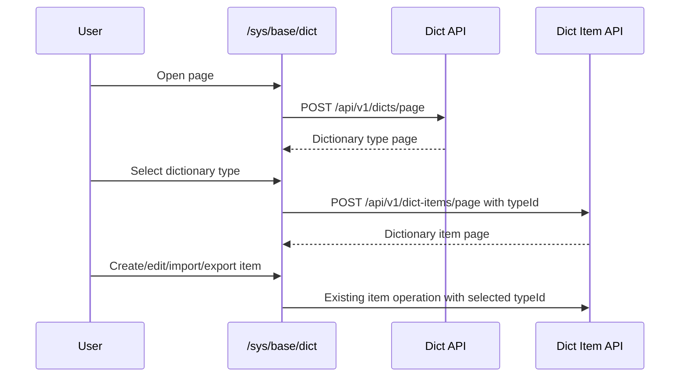

## Context

The `/sys/base/dict` page is an Ant Design Pro workspace that already uses `ProTable`, `DrawerForm`, `useAccess`, and `useIntl` to manage dictionary types and dictionary items. It calls the existing admin services in `ui/src/services/admin/dict.ts` and `ui/src/services/admin/dictItem.ts`.

The requested optimization is a frontend usability change: administrators should be able to manage dictionary types and the selected dictionary type's items in one page without changing REST APIs, backend behavior, database schema, menu permissions, or import/export contracts.

## Goals / Non-Goals

**Goals:**

- Present dictionary types and dictionary items as a coordinated single-page master-detail workflow.
- Keep the selected dictionary type visible and use it as the required context for item query, create, import, export, and delete operations.
- Improve empty, disabled, loading, and selection states so item operations are clearly unavailable until a dictionary type is selected.
- Preserve current permission checks and internationalized labels.
- Keep the page responsive for desktop and smaller viewports.

**Non-Goals:**

- No backend API path, DTO, permission, or response contract changes.
- No database migration, seed data migration, or menu/permission data change.
- No new frontend dependency or global layout pattern.
- No Kafka, WebSocket, SSE, or cross-service interaction changes.

## Decisions

### Decision: Keep the Existing Route, Services, and Drawers

The implementation will keep `/sys/base/dict`, `DictDrawer`, `DictItemDrawer`, `pageDict`, `pageDictItem`, `importDict`, `importDictItem`, `exportDict`, and `exportDictItem`.

Rationale: the change is an experience optimization, and the existing service layer already exposes all required dictionary and item operations. Keeping the contracts stable reduces rollout risk and preserves backward compatibility.

Alternative considered: introduce a combined backend endpoint returning dictionary types and items together. This was rejected because the existing selection-driven item query is sufficient and avoids unnecessary backend coupling.

### Decision: Use a Master-Detail Page Model

Dictionary types will remain the master list. Selecting one dictionary type will update the selected state and reload the dictionary item table using `typeId`. The dictionary item area will show a clear selected-dictionary context and a guided empty state when nothing is selected.

Rationale: this matches the domain relationship between dictionary types and dictionary items and minimizes context switching.

Alternative considered: use tabs or separate pages for type and item management. This was rejected because it hides the relationship and makes item maintenance slower.

### Decision: Keep Permission Gates at Existing Operation Points

The page will continue to use the existing `access.canDict*` and `access.canDictItem*` checks for table requests, toolbar actions, and row actions.

Rationale: RBAC behavior is already centralized in `ui/src/access.ts`; changing it is out of scope and would increase security risk.

### Decision: Treat Item Actions as Selection-Dependent

Dictionary item create, delete, import, export, and query will be disabled or return an empty state until a dictionary type is selected. When creating a dictionary item, the selected dictionary type's `id` will be assigned as `typeId`.

Rationale: dictionary items are invalid without a parent dictionary type. Making this dependency visible prevents accidental item operations and keeps export/import scoped.

## Risks / Trade-offs

- [Risk] Narrow two-column layouts can become cramped on smaller screens. → Mitigation: use responsive Ant Design grid behavior so the page stacks on small viewports and uses a wider item area on desktop.
- [Risk] Selection can become stale after deleting or importing dictionary types. → Mitigation: clear selected dictionary state and item selections when dictionary type data changes, then reload both tables.
- [Risk] Hidden permission actions may make the page appear empty for low-privilege users. → Mitigation: retain table empty states and permission-gated requests so users see read-only data when read permission exists and no unauthorized actions when it does not.
- [Risk] Exporting items without a selected dictionary type could export unintended data. → Mitigation: keep item export disabled without selection and always include the selected `typeId`.

## Migration Plan

Deploy as a frontend-only change. No database migration, backend deployment, Kafka topic, or message format change is required.

Rollback by reverting the modified frontend page and any related locale or style changes. Existing data, APIs, and permissions remain compatible.

## Open Questions

- None. The implementation can proceed using the existing API and permission model.
