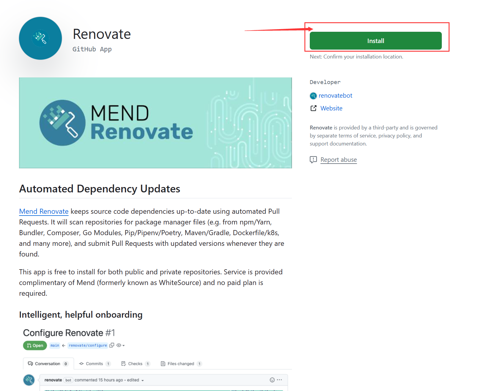
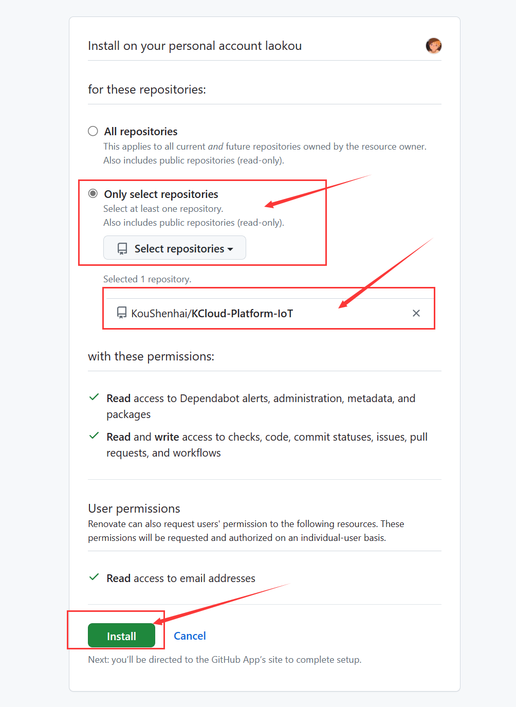

[[github-ci-dependency-robot]]
= Github CI之依赖机器人
:revdate: {docdate}
:toc: left
:Author: laokou
:doctype: document
:toclevels: 4
:tabsize: 4

:numbered:

== Dependabot

=== 介绍

--
  Dependabot负责维护您的依赖项。您可以使用它来确保仓库自动跟上它所依赖的包和应用程序的最新版本。
  通过将dependabot.yml配置文件写入存储库，可启用Dependabot version updates。
  配置文件指定存储在仓库中的清单或其他包定义文件的位置，Dependabot使用此信息检查过时的包和应用程序。
--

=== 官方地址

https://docs.github.com/zh/code-security/dependabot/dependabot-version-updates/about-dependabot-version-updates[Dependabot官方地址]

=== 拉取请求的频率

配置文件中指定检查每个生态系统的新版本的频率：每日、每周或每月

=== 自动停用

当存储库的维护者停止与Dependabot拉取请求交互时，Dependabot会暂时暂停其更新并发出通知

=== 启用依赖检查

==== 创建仓库

--
  在Github上面创建一个开源仓库
--

==== 创建文件

--
  先在根目录创建.github文件夹,然后创建dependabot.yml文件
--

image:image/tools/img_4.png[创建文件图片,200,align=left]

==== 编写内容

[source%nowrap,yaml]
----
version: 2
updates:
  - package-ecosystem: "maven" # See documentation for possible values
    directory: "/" # Location of package manifests
    schedule:
      interval: "weekly" # 必填，每周执行一次，默认周一执行
----

==== 提交代码

--
  git add .github/dependabot.yml && git commit -m "提交依赖版本更新插件" && git push 
--

==== 查看PR

--
  返回到项目，在Pull requests查看更新过期依赖版本所提交的请求
--

image:image/tools/img_5.png[更新过期依赖版本所提交的请求图片,400,align=left]

=== 配置说明

==== schedule.interval

--
  检查新版本的频率，有3种时间类型
--

[width=100%]
|===
|频率      |说明

|daily    |每个工作日（周一至周五）运行
|weekly   |每周运行一次。默认情况下为星期一，若要对此进行修改，请使用schedule.day
|monthly  |每月运行一次。在每月的第一天运行
|===

==== schedule.day

--
  指定每周星期几执行一次,有7个值
  monday     => 星期一
  tuesday    => 星期二
  wednesday  => 星期三
  thursday   => 星期四
  friday     => 星期五
  saturday   => 星期六
  sunday     => 星期日
--

[source%nowrap,yaml]
----
version: 2
updates:
  - package-ecosystem: "maven" # See documentation for possible values
    directory: "/" # Location of package manifests
    schedule:
      interval: "weekly" # 必填，每周执行一次，默认周一执行
      day: "sunday" # 每周日执行一次
----

== Renovate

=== 介绍

--
  Mend Renovate 使用自动拉取请求使源代码依赖项保持最新状态。
--

=== 安装地址

https://github.com/apps/renovate[Renovate安装地址]

=== 启用依赖更新

检查 `renovate.json` 配置

[source%nowrap,json]
----
{
  "$schema": "https://docs.renovatebot.com/renovate-schema.json",
  "extends": ["config:base"]
}
----

image:image/tools/img_8.png[Renovate启用依赖更新3]
